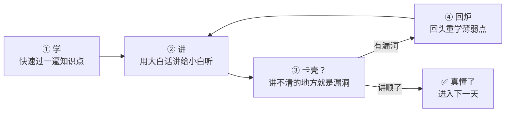
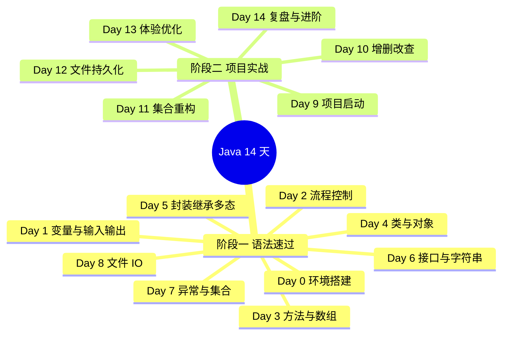

# ☕ Java 入门：从语法到完整项目

> **快速过语法，尽早写代码。** 用费曼学习法，14 天做出一个属于你自己的「控制台学生管理系统」。

## 这套计划适合谁

- 完全没写过代码，或只看过一点教程、从没独立写出过程序的人
- 目标是**尽快动手**：不想在语法细节里停留太久，想用写代码来学代码
- 每天能投入 **1.5 ~ 2 小时**，连续 14 天（中断一两天没关系，别断一周）

## 三个核心原则

1. **最小必要知识**：每个知识点只讲「马上要用的那 20%」，剩下的用到再查。查文档、搜索报错，本身就是程序员的核心技能。
2. **60% 时间写代码**：每天的文档里，代码练习占大头。看懂 ≠ 会写，手敲一遍才算数。
3. **每天费曼一次**：把当天学的东西，用大白话讲给一个「完全不懂编程的人」听。讲不下去的地方，就是你没真懂的地方。

## 什么是费曼学习法

一句话版本：**以教代学** —— 通过把知识讲给别人听，来逼自己真正理解它。



本计划每天的文档末尾都有一个 **🧠 费曼时刻** 板块，提供教学卡片模板，把你的讲解写下来（或讲给朋友/AI 听），这是每天最重要的产出。

## 14 天路线图



- **阶段一（Day 0–8）**：每天一个主题，速览知识点后立刻写 2~3 个小程序（BMI 计算器、猜数字游戏、学生类设计……）。这些练习不是孤立的，它们正是最终项目的零件。
- **阶段二（Day 9–14）**：从零搭一个**控制台学生管理系统**：菜单 → 增删改查 → 用集合重构 → 数据存文件 → 输入校验与体验优化。每天都运行、每天都比昨天更好用。

## 每天的文档长什么样

| 板块 | 作用 |
|---|---|
| 🎯 今日目标 | 当天结束时你应该会什么，不超过 3 条 |
| ⚡ 知识点速览 | 最小必要知识，配图表辅助理解 |
| 💻 跟着写 | 代码练习，从「跟打」到「独立写」逐步放手 |
| 🧠 费曼时刻 | 用大白话输出教学卡片 |
| ✅ 自测清单 | 全部答上来，才进入下一天 |

**本站不提供完整参考答案**：文档只给关键片段、骨架代码和提示。手敲、报错、调试，是零基础阶段最宝贵的经历。

## 怎么阅读本站

文档源是纯 Markdown，通过 Docsify 渲染成网页。在仓库根目录起一个本地服务：

```bash
# 在仓库根目录执行（Windows 上也可能是 py -m http.server）
python -m http.server 3000 --directory docs --bind 127.0.0.1
```

然后浏览器打开 <http://127.0.0.1:3000> 即可（把 `docs` 目录作为站点根目录）。

也可以用 **VS Code 的 Live Server 插件**：右键 `docs/index.html` → Open with Live Server。

> 📌 站点的 JS 库通过 CDN 加载，**首次打开需要联网**。

## 学习进度打卡

- [ ] Day 0 · 环境搭建
- [ ] Day 1 · 第一个程序与变量
- [ ] Day 2 · 流程控制
- [ ] Day 3 · 方法与数组
- [ ] Day 4 · 类与对象
- [ ] Day 5 · 封装继承多态
- [ ] Day 6 · 接口与常用类
- [ ] Day 7 · 异常与集合
- [ ] Day 8 · 文件 IO
- [ ] Day 9 · 项目启动
- [ ] Day 10 · 增删改查
- [ ] Day 11 · 集合重构
- [ ] Day 12 · 文件持久化
- [ ] Day 13 · 异常与体验优化
- [ ] Day 14 · 复盘与进阶

## 🔧 延伸课程

- **[Git 入门：拉取、推送与合并](git/README.md)**（约 1.5 小时）—— 管理代码版本、和未来的伙伴协作，建议在开始 Day 9 前后完成
- **[Python 入门：快速上手与实践](python/README.md)**（约 2 小时）—— 另一门必备语言的最小集入门，练习题复刻 Java 计划经典题目（BMI、猜数字、单词计数），同题异构对比两门语言
- **[Markdown 入门：写作即排版](markdown/README.md)**（约 1 小时）—— 程序员的通用写作格式：本站文档和你的费曼卡片都是 Markdown，学完即可给本站贡献文档

**🤖 元技能**：[用 ZCode 创建入门教程](zcode/README.md) —— 本站全部内容是怎么用 AI 定制出来的？复盘真实过程，提炼成可复用的流程和提示词模板，下次想学任何新东西都可以照着做。

**🗄️ 进阶**：[MySQL 入门：从 SQL 到 JDBC](mysql/README.md) —— Java 进阶路线（MySQL + JDBC → Spring Boot）的第一站：SQL 增删改查建表、JDBC 五步走，并把学生管理系统的数据从文件迁移进数据库。

准备好了？进入 [Day 0 · 环境搭建](java/day00-环境搭建.md) 🚀
