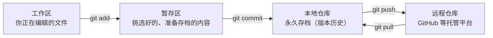
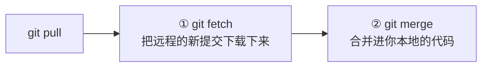
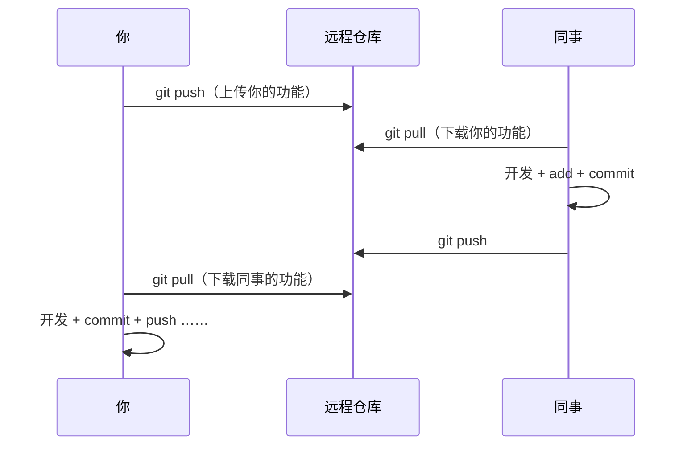
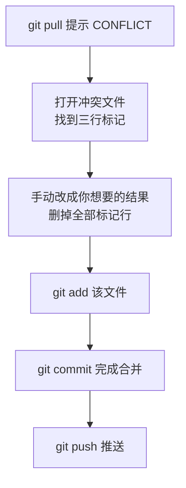

# 🔧 Git 入门：拉取、推送与合并

> ⏱ 建议用时：1.5 小时 ｜ 🎯 目标：会保存代码版本、会推送到远程仓库、会拉取别人的改动并解决合并冲突

## 这篇教程解决什么问题

写代码最怕两件事：**改崩了回不去**，和**多人一起改同一份代码互相覆盖**。Git 就是解决这两个问题的版本管理工具 —— 类比游戏存档：随时存档（commit）、随时读档（回退）、多人联机时同步进度（push / pull）。

本篇只讲日常最常用的部分：**本地保存 + 推送（push）+ 拉取（pull）+ 合并（merge）**。分支管理、rebase 等进阶内容以后用到再学。

## 第 0 步：安装与首次配置

Windows 用户安装 [Git for Windows](https://git-scm.com/download/win)（一路下一步），装完在开始菜单打开 **Git Bash** 练习。然后做一次性的身份配置：

```bash
git config --global user.name "你的名字"
git config --global user.email "你的邮箱"
git config --global init.defaultBranch main
```

> 这个名字和邮箱会写进每一次提交记录，相当于代码世界的署名。

## 核心概念：四个区域

Git 的所有日常操作，都是在下面四个区域之间搬运文件：



| 区域 | 在哪 | 一句话理解 |
|---|---|---|
| 工作区 | 你的项目文件夹 | 正在写的手稿 |
| 暂存区 | Git 内部 | 装订前的书页 —— 勾选这次要存档哪些改动 |
| 本地仓库 | 项目里的 `.git` 文件夹 | 已经装订成册的历史存档 |
| 远程仓库 | GitHub / Gitee 服务器 | 云端备份 + 团队共享的存档 |

> 💡 为什么要有暂存区？因为一次提交应该是一个完整的「小功能」，暂存区让你能从一堆改动里**挑选**这次要存哪几处。

## 本地基本功：存档三连

这三条在 Java 计划的 [Day 9](/java/day09-项目启动.md) 已经用过，快速复习：

```bash
git status                 # 指南针：随时查看现在什么状态
git add 文件名              # 把改动放进暂存区（git add . = 全部）
git commit -m "day9: 菜单骨架跑通"   # 暂存区内容存档，-m 后是本次改动的说明
git log --oneline          # 查看存档历史（一行一条）
```

**习惯**：每完成一个小功能就 commit 一次，说明写清楚「做了什么」—— 这是你将来回溯历史的唯一线索。

## 远程协作三件套

### push：把我的存档上传

```bash
git push
```

把本地仓库的提交上传到远程仓库。第一次推送新分支时 Git 会提示完整写法（如 `git push -u origin main`），照抄即可。

### pull：把别人的改动下载并合并

```bash
git pull
```

`pull` 其实是两个动作的合体：



如果远程的改动和你本地的**没有碰同一个地方**，Git 会自动合并好，什么都不用做（显示 `Merge made by the 'ort' strategy` 之类的信息）。

### 两人协作的真实时间线



**铁律：每次开始写代码前先 `git pull`，提交推送前也先 `git pull`** —— 越频繁同步，冲突越少越小。

## 合并冲突：必然会发生，不可怕

### 冲突是怎么产生的

你和同事**改了同一个文件的同一个位置**，又各自 commit —— Git 无法替你决定该听谁的，于是把选择权交给你：

```bash
git pull
# Auto-merging src/Main.java
# CONFLICT (content): Merge conflict in src/Main.java
# Automatic merge failed; fix conflicts and then commit the result.
```

### 解决冲突五步法



冲突文件里会长这样（Git 自动插入的标记）：

```text
<<<<<<< HEAD
int maxStudents = 100;      ← 你的版本（HEAD = 你当前所在的位置）
=======
int maxStudents = 200;      ← 远程/同事的版本
>>>>>>> origin/main
```

处理原则：**保留正确的代码（也可以两者融合成新写法），然后删掉 `<<<<<<<`、`=======`、`>>>>>>>` 这三行标记本身**。`git status` 会列出所有冲突文件，逐个处理即可。

> 💡 冲突不是事故，是 Git 在说：「两个人同时改了这里，我机器猜不到你们人类的意图，你来定。」解决冲突的能力 = 协作开发的基本功。

## 💻 动手练习：一个人模拟两个人协作

不用 GitHub，用本地「裸仓库」当远程，10 分钟体验完整的 推送 → 拉取 → 冲突 → 合并 循环（Git Bash 中执行）：

### 练习 1：搭一个两人协作环境

```bash
mkdir git-practice && cd git-practice
git init --bare shared.git          # 「远程仓库」：只存历史、没有工作区，专用于共享
cd ..

git clone git-practice/shared.git alice    # 同事 A 的副本（会提示克隆了空仓库，正常）
git clone git-practice/shared.git bob      # 同事 B 的副本
```

### 练习 2：推送与拉取

```bash
# --- alice 先开工 ---
cd alice
echo "# 协作练习" > README.md
git add . && git commit -m "alice: 初始化项目"
git push                              # 首次推送按提示执行 git push -u origin main

# --- bob 同步 alice 的成果 ---
cd ../bob
git pull                              # 下载到 alice 刚推送的内容
cat README.md                         # 能看到「协作练习」，同步成功！
```

### 练习 3：制造并解决一次冲突

```bash
# --- alice 改第一行并推送 ---
cd ../alice
echo "# alice 的版本" > README.md
git add . && git commit -m "alice: 改标题"
git push

# --- bob 改同一行，也提交（先不 push）---
cd ../bob
echo "# bob 的版本" > README.md
git add . && git commit -m "bob: 改标题"
git push                              # ❌ 被拒绝！远程有 alice 的新提交
git pull                              # 出现 CONFLICT 提示
```

打开 `bob/README.md`，你会看到冲突标记。手动改成想要的结果（比如 `# 我们合并后的版本`），删掉三行标记，然后：

```bash
git add README.md
git commit -m "解决标题冲突"
git push

# --- alice 再拉取，拿到合并结果 ---
cd ../alice
git pull
cat README.md
```

走完这一圈，push / pull / merge / 冲突解决就全部亲手体验过了。🎉

## 📌 速查表

| 命令 | 作用 | 使用时机 |
|---|---|---|
| `git status` | 查看当前状态 | 迷路时、每步操作前后 |
| `git add .` | 全部改动放入暂存区 | 准备存档时 |
| `git commit -m "说明"` | 存档一次 | 每完成一个小功能 |
| `git log --oneline` | 查看历史 | 想看做了什么 / 回溯时 |
| `git push` | 上传到远程 | 功能完成、下班前 |
| `git pull` | 下载远程并合并 | **每天开工前、每次 push 前** |
| `git merge 分支名` | 合并指定分支 | 整合他人/他分支工作时 |

## ❓ 常见问题

| 现象 | 原因与解法 |
|---|---|
| push 被拒：`non-fast-forward` | 远程有你没有的新提交 → 先 `git pull`（可能要解决冲突）再 push |
| pull 之后好像「卡住」了 | 其实在等你完成合并：`git status` 看提示，处理好冲突后 `add + commit` |
| commit 时弹出看不懂的编辑器 | 那是合并提交的说明文件（Git Bash 默认 vim）：输入 `:wq` 回车保存退出 |
| `Already up to date.` | 远程没有新东西，你已是最新，不是报错 |
| 搞砸了不知道怎么办 | 先 `git status`，它会告诉你下一步；别慌着重装或删库 |

## 🧠 费曼时刻

**教学卡片**：

```markdown
## Git 入门教学卡片：拉取、推送与合并
- 用「游戏存档」讲清楚：工作区、暂存区、本地仓库、远程仓库分别是什么？
- push 和 pull 的方向：谁流向谁？各在什么时候做？
- 冲突发生时，Git 帮你做了什么、没做什么？（提示：它标出了战场，但没替你决定胜负）
- 我讲卡壳的地方：
```

## ✅ 自测清单

- [ ] 能画出（或口述）四个区域和 add / commit / push / pull 的流向图
- [ ] 知道「每次开工前、push 前先 pull」这条铁律
- [ ] 练习 3 中亲手制造并解决过一次冲突
- [ ] 看到冲突标记知道哪段是自己的、哪段是对方的
- [ ] push 被拒（non-fast-forward）知道第一步做什么
- [ ] 完成了今天的教学卡片

## 🔗 下一步

- 回到 [Java 学习计划](/java/day09-项目启动.md)，从 Day 9 起把你的学生管理系统用 Git 管起来
- 想要图形界面：安装 [GitHub Desktop](https://desktop.github.com/) 或直接用 IDEA 自带的 Git 面板（右键文件 → Git）
- 进阶（用到再学）：分支 `branch` / `checkout`、查看差异 `diff`、回退 `reset`、`.gitignore` 详解
