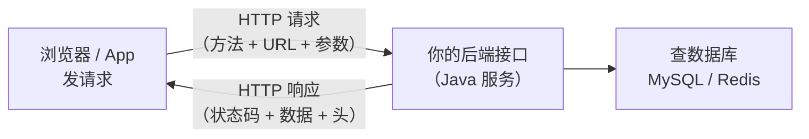

# 🌐 HTTP / REST 入门：理解 Web 世界的语言

> ⏱ 建议用时：2 小时 ｜ 🎯 目标：看懂一次网络请求的完整来龙去脉，会用 RESTful 的「资源 + 动词」设计接口，知道后端 API 长什么样

## 这篇教程解决什么问题

你写的 Java / Python 程序目前都是**本地跑的命令行**，但真实的互联网应用长这样：浏览器或手机 App 通过**网络**请求你后端的**接口**，后端返回数据。这套「前后端如何通信」的规矩，就是 **HTTP 协议**。

本教程讲两件事：**① HTTP 协议本身**（浏览器和服务器之间一次对话的细节）和 **② REST 风格**（把这种通信约定成一种好懂好维护的接口设计规范）。学完你就能看懂「为什么要用 Spring Boot 写接口」，也是把 [学生管理系统](/java/day09-项目启动.md) 升级成 Web 应用（Day 14 进阶路线里提到的方向）的第一步。



## 第 1 部分：HTTP 是什么

### 一次请求 = 一问一答

HTTP 是「**客户端问、服务器答**」的问答协议。你每次打开网页，背后都是「浏览器发请求 → 服务器回响应」。完整的请求和响应各自长这样：

```http
# —— 请求（客户端发给服务器）——
GET /students?grade=1 HTTP/1.1
Host: api.example.com
Accept: application/json

# —— 响应（服务器回给客户端）——
HTTP/1.1 200 OK
Content-Type: application/json

[{"id":1001,"name":"小明","score":88.5}]
```

一次对话里包含了：**方法**（GET）、**路径**（/students）、**状态码**（200）、**头部字段**（Content-Type）、**内容**（JSON）。拆开看：

### 请求方法：告诉服务器「我想要的动词」

| 方法 | 含义 | 类比 |
|---|---|---|
| `GET` | 获取数据 | 看/问 |
| `POST` | 新增数据 | 提交/新建 |
| `PUT` | 整体更新 | 替换 |
| `PATCH` | 局部更新 | 改其中一项 |
| `DELETE` | 删除 | 划掉 |

### 状态码：服务器给你的「表情包」

| 状态码 | 含义 | 场景 |
|---|---|---|
| `200` | 成功 | GET/POST 都常返回它 |
| `201` | 创建成功 | POST 新增 |
| `301/302` | 重定向 | 跳转到新地址 |
| `400` | 请求格式错误 | 参数少了/类型不对 |
| `401` | 未认证 | 没登录或 token 失效 |
| `403` | 没权限 | 登录了但无权访问 |
| `404` | 找不到 | 路径错或资源不存在 |
| `500` | 服务器内部错误 | 后端代码抛异常 |

> 📌 不用背全，记住规律即可：**2xx 成功、4xx 是客户端（你）的问题、5xx 是服务端（后端）的问题。**

### URL 结构：让服务器知道「要哪件东西」

```http
https :// api.example.com /students/1001?grade=1&sort=score
└协议┘  └────主机────┘ └─路径─┘ └─────查询参数─────┘
```

- **路径**（path）：定位「哪种资源」，如 `/students`
- **查询参数**（query）：可选的筛选条件，如 `?grade=1` 按年级筛

## 第 2 部分：REST 风格——用好懂的方式约定接口

REST 是人气最高的接口设计规范。核心思想一句话：**把数据看成「资源」，用 URL 定位它，用 HTTP 方法表示对它做什么。**

### 以学生的增删改查为例

传统设计可能是 `getStudentlist()`、`deleteStudentById()` 这种，URL 全靠猜。REST 风格是这样约定的：

| 操作 | REST 接口（方法 + 路径） | 说明 |
|---|---|---|
| 查全部/查筛选 | `GET /students` | 取资源列表 |
| 查单个 | `GET /students/1001` | 取路径里的 id 资源 |
| 新增 | `POST /students` | 在集合下建新资源 |
| 更新 | `PUT /students/1001` | 整体替换某资源 |
| 删单个 | `DELETE /students/1001` | 删某个资源 |

**规律**：URL 用**名词复数**（`students` 是集合，`students/1001` 是单个），永远「面向资源」；一个资源对应一套 GET/POST/PUT/DELETE，一目了然。

> 💡 你其实早见过它了——[MySQL 教程](/mysql/README.md)里同名的「学生资源」，这里只是给它配上了网络入口。把命令行操作搬到 Web 上，就是「增删改查 → 4 个 HTTP 接口」的转换。

### 前后端如何传数据：JSON

接口之间传输数据用 **JSON**（一眼能读懂的文本格式），长这样：

```json
{
  "id": 1001,
  "name": "小明",
  "score": 88.5
}
```

对应你的 Java `Student` 类（[Day 4](/java/day04-类与对象.md)）：字段名一致，类型对应。后端把对象 `序列化`成 JSON 返回，前端拿到再 `反序列化`成它能用的结构——这是前后端协作的契约。

## 💻 动手练习：用浏览器和 curl 发一次真实请求

### 练习 1：先感受一次 GET（约 10 分钟）

不需要装任何东西，直接用浏览器或命令行访问一个公开接口试试：

```bash
# 打开浏览器地址栏直接输入，看返回的 JSON
# https://api.github.com/users/octocat  （GitHub 公开用户信息接口）

# 或用命令行（Git Bash 自带 curl）
curl -s https://api.github.com/users/octocat
```

观察你看到的东西：`"name": "The Octocat"` 是响应体，`200` 是状态码。从一个「看得到的接口」开始，比直接啃理论直观多了。

### 练习 2：读懂一个响应头（约 15 分钟）

```bash
curl -i https://api.github.com/users/octocat   # -i 显示响应头
```

看看里面有没有 `Content-Type: application/json`、`status` 等——这些是服务器给你的元信息。

### 练习 3（进阶）：用 curl 模拟增删改查（约 20 分钟）

如果嫌命令行不过瘾，可以用 curl 直接对接口发 REST 风格的请求（下面用假地址示意，重点是格式）：

```bash
curl -X GET    http://localhost:8080/students        # 查列表
curl -X POST   -H "Content-Type: application/json" \
     -d '{"name":"小刚","age":21,"score":76.5}' http://localhost:8080/students
curl -X GET    http://localhost:8080/students/1001   # 查单个
curl -X DELETE http://localhost:8080/students/1001   # 删除
```

> 这套 `-X / -H / -d` 的写法正是「面向资源的 HTTP」的实际样子，等 [Spring Boot](/java/day14-复盘与进阶.md) 讲完你就能自己搭这样一个接口。

## ❓ 常见问题

| 现象 | 原因与解法 |
|---|---|
| `curl` 提示不是命令 | Windows 用 Git Bash 或 PowerShell 里的 `curl`；普通 cmd 可能是旧版，装 Git 就自带 |
| 打开网页只看到 JSON | 正常！那是 API 接口的原始数据，浏览器只是没排版。想好看可装格式化插件 |
| 访问接口返回 `404` | 路径写错，或资源不存在（多数是 `/students` vs `/students/1001` 搞混） |
| 返回 `500` | 是**后端**出了问题（代码异常），不是你的错，联系/检查服务 |
| POST 后没返回 `201` | 有的后端简化用 `200` 也行，不影响；只要数据存进去就行 |

## 🧠 费曼时刻

**教学卡片**：

```markdown
## HTTP / REST 入门教学卡片
- 用「点餐」类比讲：客户端/服务器、请求/响应分别是什么角色、各发送什么？
- GET / POST / PUT / DELETE 对应点餐的哪几种动作？
- 2xx / 4xx / 5xx 各表示什么？举一个每次请求都对应的例子
- REST 的核心思想一句话；为什么 URL 用名词复数？
- JSON 和 Java 类的关系是什么？（序列化/反序列化）
- 我讲卡壳的地方：
```

## ✅ 自测清单

- [ ] 能说出 HTTP 请求由哪几部分组成（方法/路径/头/体）
- [ ] 会背 GET / POST / PUT / DELETE 四种方法的用途
- [ ] 看到 `404`/`500` 知道是前端还是后端的问题
- [ ] 能把「查学生列表、查单个、新增、删除」写成 4 个 REST 接口
- [ ] 用 curl 成功请求了一个真实接口并看到返回
- [ ] 能解释 JSON 是前后端之间传数据的格式
- [ ] 完成了今天的教学卡片

## 🔗 下一步

- **动手实现**：等学完 [Spring Boot](/java/day14-复盘与进阶.md)（Day 14 进阶路线下一步），就能用 `@RestController` 把学生管理系统变成真正的 REST API
- **扩展**：把 [Redis](/redis/README.md) 的缓存能力用在你的接口上，加速响应
- **工具链**：学会用 [Postman](https://www.postman.com/) 或 Apifox 这类接口调试工具，比 curl 更直观地发请求、看返回
- **纵深**：理解 HTTPS（加密版 HTTP 加了 TLS 层）、Cookie / Token（登录态的传递）
