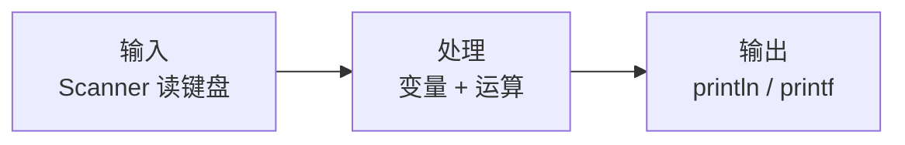

# Day 1 · 第一个程序与变量

> 📅 阶段一：语法速过 ｜ ⏱ 建议用时：1.5~2 小时 ｜ 💻 今天起，代码练习占大头

## 🎯 今日目标

1. 会用变量存数据、用 `int` / `double` / `boolean` / `String` 四类常用类型
2. 会用 `Scanner` 从键盘读输入
3. 独立写出一个「输入 → 计算 → 输出」的小程序（BMI 计算器）

## ⚡ 知识点速览

### 先看懂程序骨架（不用背，每天写自然会熟）

```java
public class Hello {                    // 类：代码的「容器」，文件名与它同名
    public static void main(String[] args) {   // main：程序入口，从这里开始执行
        System.out.println("Hello!");   // 打印一行
    }
}
```

今天你只需要关心 `main` 花括号**里面**的代码。

### 常用类型：只记这 4 个

Java 类型有 8 种基本类型 + 无数字符串，零基础阶段记住这 4 个就够用：

| 类型 | 存什么 | 例子 | 备注 |
|---|---|---|---|
| `int` | 整数 | `int age = 20;` | 年龄、数量、编号 |
| `double` | 小数 | `double price = 9.9;` | 成绩、金额、身高 |
| `boolean` | 真 / 假 | `boolean isVip = true;` | 只有 `true` / `false` 两个值 |
| `String` | 字符串（文本） | `String name = "小明";` | 注意**双引号**，S 大写 |

> 💡 其余类型（`long`、`float`、`char` 等）以后用到再学。类型不够用时编译器会告诉你。

### 变量：贴了标签的盒子

```java
int age = 20;          // 声明一个 int 型变量 age，装入 20
age = age + 1;         // 取出 20，加 1，放回去 → 现在 age 是 21
String name = "小明";   // 每个盒子有类型，装错类型编译器直接报错
```

### 输入与输出

```java
import java.util.Scanner;                      // 放在文件最顶部（IDEA 按 Alt+Enter 自动导）

Scanner sc = new Scanner(System.in);           // 1. 创建一个“键盘读取器”

String name = sc.next();                       // 读一个词（到空格为止）
int age = sc.nextInt();                        // 读一个整数
double height = sc.nextDouble();               // 读一个小数

System.out.println("你好，" + name);            // 字符串用 + 拼接
System.out.printf("明年你 %d 岁，身高 %.2f 米%n", age + 1, height);
// printf 格式符：%d 整数、%f 小数（%.2f 保留两位）、%s 字符串、%n 换行
```

### 常用运算符（1 分钟扫一眼）

```java
int a = 7, b = 2;
a + b    // 9    加
a - b    // 5    减
a * b    // 14   乘
a / b    // 3    ⚠️ 整数相除会丢掉小数！
a % b    // 1    取余数（判断奇偶、倍数常用）
(double) a / b   // 3.5  想要小数，先转成 double
```

今天的程序模型就一句话：**输入 → 处理 → 输出**。



## 💻 跟着写

### 练习 1：自我介绍卡片（跟打，约 15 分钟）

新建类 `IntroCard`，跟着敲下面代码并运行，然后**改成人肉版**（换成你自己的信息，再加一个爱好变量）：

```java
import java.util.Scanner;

public class IntroCard {
    public static void main(String[] args) {
        Scanner sc = new Scanner(System.in);

        System.out.print("请输入你的名字：");
        String name = sc.next();

        System.out.print("请输入你的年龄：");
        int age = sc.nextInt();

        System.out.println("========== 自我介绍 ==========");
        System.out.println("姓名：" + name);
        System.out.printf("年龄：%d，五年后 %d 岁%n", age, age + 5);
        System.out.println("==============================");
    }
}
```

### 练习 2：BMI 计算器（半独立，约 25 分钟）

BMI = 体重(kg) ÷ 身高(m) ÷ 身高(m)。需求：

- 输入身高（米，小数）和体重（公斤，整数）
- 输出 BMI 值（保留 1 位小数）和体型提示：`< 18.5` 偏瘦、`18.5 ~ 23.9` 正常、`>= 24` 偏胖（判断还没学？**先用 if 试试**，明天正式学，猜着写也是一种学习）

骨架给你，`TODO` 处自己补：

```java
import java.util.Scanner;

public class BmiCalculator {
    public static void main(String[] args) {
        Scanner sc = new Scanner(System.in);
        System.out.print("身高（米）：");
        double height = sc.nextDouble();
        System.out.print("体重（公斤）：");
        int weight = sc.nextInt();

        double bmi = 0; // TODO: 按公式计算

        System.out.printf("你的 BMI 是 %.1f%n", bmi);
        // TODO: 输出体型提示
    }
}
```

### 练习 3：超市小票（独立，约 20 分钟）

- 输入商品名、单价、数量
- 输出一行小票：`可乐 x 3，共 9.0 元`，满 10 元打 9 折

> ⚠️ 大概率遇到的报错：`InputMismatchException`（输入的类型和读取方法不匹配，比如该输数字时输了文字）—— 先读报错最后一行找原因，明天 Day 7 会正式收服它。**报错是常态，别慌。**

## 🧠 费曼时刻

**教学卡片**：

```markdown
## Day 1 教学卡片：变量与类型
- 用我自己的话讲「什么是变量」：
- int、double、String 分别什么时候用？（各举一个生活例子）
- 7 / 2 等于几？为什么？怎么得到 3.5？
- 我讲卡壳的地方：
```

讲不明白的点，回到上面重看，再看不明白就动手写代码试 —— **代码是最好的老师**。

## ✅ 自测清单

- [ ] 能不看笔记写出：声明一个字符串变量并打印它
- [ ] 知道 `sc.nextInt()` 和 `sc.nextDouble()` 的区别
- [ ] 知道 `7 / 2` 和 `7.0 / 2` 结果为什么不同
- [ ] BMI 计算器跑起来了，输出格式正确
- [ ] 完成了今天的教学卡片

---
[⬅️ 上一天](day00-环境搭建.md) ｜ [🏠 返回首页](/) ｜ [下一天：流程控制 ➡️](day02-流程控制.md)
