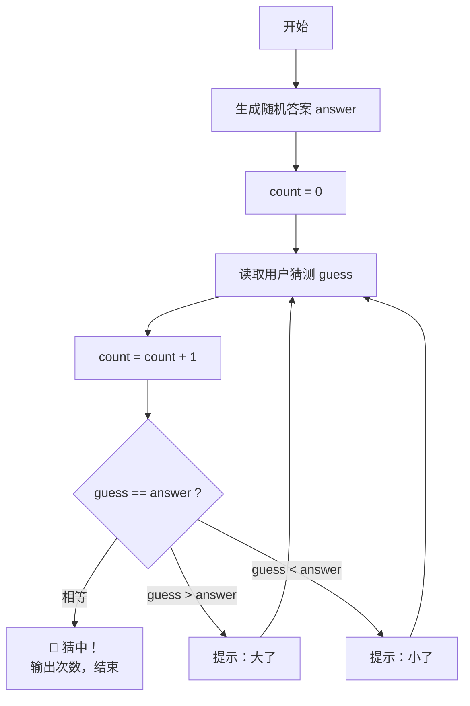

# Day 2 · 流程控制

> 📅 阶段一：语法速过 ｜ ⏱ 建议用时：1.5~2 小时 ｜ 💻 今天产出：你的第一个游戏 —— 猜数字

## 🎯 今日目标

1. 会用 `if / else` 和比较、逻辑运算符做判断
2. 会用 `for` / `while` 循环，知道什么时候用哪个
3. 独立完成**猜数字游戏**（输入 + 循环 + 判断的全组合）

## ⚡ 知识点速览

### 判断：if / else

```java
int score = 75;

if (score >= 90) {
    System.out.println("优秀");
} else if (score >= 60) {        // 上面不成立才看这里
    System.out.println("及格");
} else {
    System.out.println("不及格");
}
```

比较运算符：`==` 等于、`!=` 不等于、`>` `<` `>=` `<=`，结果是 `boolean`。

逻辑运算符把多个条件串起来：

```java
if (age >= 18 && age <= 60) { ... }   // && 并且：两边都真才真
if (isVip || score > 95) { ... }      // || 或者：一边真就真
if (!isLocked) { ... }                // ! 取反
```

> ⚠️ **天坑预警**：判断字符串相等**不能用 `==`**，要用 `.equals()`：
> ```java
> if (name.equals("admin")) { ... }        // ✅ 对
> if (name == "admin") { ... }             // ❌ 有时灵有时不灵，别赌
> ```

### 循环：跑圈的艺术

`for` —— 知道要跑几圈时用（比如遍历 1~100）：

```java
for (int i = 1; i <= 5; i++) {     // 四段：初始化; 条件; 每圈收尾动作
    System.out.println("第 " + i + " 圈");
}
// 拆解：i=1 时检查 1<=5 ✓ 执行 → i 变 2 → 检查 2<=5 ✓ …… 直到 i=6 时 6<=5 ✗ 退出
```

`while` —— 不知道几圈、只看条件时用（比如「直到猜对为止」）：

```java
while (guess != answer) {          // 条件为真就一直转
    guess = sc.nextInt();
}
```

两个跳出的关键词：

- `break`：立刻跳出整个循环（游戏通关）
- `continue`：跳过这一圈剩下的代码，直接进入下一圈（筛选）

### 今天的主角：猜数字游戏流程

程序随机生成 1~100 的整数，用户不断猜，程序提示「大了 / 小了」，猜中显示用了几次：



随机数生成一行（今天先当黑盒用）：

```java
int answer = (int) (Math.random() * 100) + 1;   // 1~100 的随机整数
```

## 💻 跟着写

### 练习 1：成绩分级器（跟打，约 15 分钟）

```java
import java.util.Scanner;

public class Grade {
    public static void main(String[] args) {
        Scanner sc = new Scanner(System.in);
        System.out.print("请输入成绩（0-100）：");
        int score = sc.nextInt();

        if (score > 100 || score < 0) {
            System.out.println("成绩不合法");
        } else if (score >= 90) {
            System.out.println("优秀");
        } else if (score >= 80) {
            System.out.println("良好");
        } else if (score >= 60) {
            System.out.println("及格");
        } else {
            System.out.println("不及格，加油！");
        }
    }
}
```

跑几组数据：`95`、`80`、`60`、`59`、`-5`，确认每个分支都走到过。

### 练习 2：猜数字游戏（核心练习，约 40 分钟）

对照上面的流程图，自己实现。卡住了再看提示，**别一上来就看**：

<details>
<summary>💡 提示 1：整体骨架</summary>

```java
import java.util.Scanner;

public class GuessNumber {
    public static void main(String[] args) {
        int answer = (int) (Math.random() * 100) + 1;
        Scanner sc = new Scanner(System.in);
        int count = 0;

        while (true) {                     // 死循环 + break 跳出，是交互程序的常用套路
            System.out.print("猜一个 1-100 的数：");
            int guess = sc.nextInt();
            // TODO: count 加 1
            // TODO: 三种情况：相等 → 打印次数并 break；大了/小了 → 给提示
        }
    }
}
```
</details>

<details>
<summary>💡 提示 2：进阶需求（做完基础版再加）</summary>

- 猜了 7 次还没中 → 输出「太笨了，答案是 xx」并结束
- 一局结束后问「再来一局吗？(y/n)」，输入 `y` 重新生成答案再来（外层再套一个 `while`）
</details>

### 练习 3：九九乘法表（独立，约 20 分钟）

输出：

```
1x1=1
1x2=2 2x2=4
1x3=3 2x3=6 3x3=9
...
```

提示：两层 `for` 嵌套，外层控制行 `i`，内层 `j` 从 1 到 `i`；用 `System.out.print()`（不换行）+ 每行末尾一个 `println()`。这是双重循环的入门名题，值得亲手磨出来。

## 🧠 费曼时刻

**教学卡片**：

```markdown
## Day 2 教学卡片：判断与循环
- if/else 像生活中的什么？（岔路口？安检？）
- for 和 while 各举一个「只能用它才顺手」的场景
- break 和 continue 的区别，用一个游戏里的例子讲
- 判断两个字符串相等，为什么不能用 ==？
- 我讲卡壳的地方：
```

## ✅ 自测清单

- [ ] 能白板写出 `for` 循环的四段结构并说清执行顺序
- [ ] 猜数字游戏完整跑通，包括「再来一局」进阶版
- [ ] 九九乘法表输出正确
- [ ] 能说出一个 `&&` 和 `||` 的使用例子
- [ ] 完成了今天的教学卡片

---
[⬅️ 上一天](day01-第一个程序与变量.md) ｜ [🏠 返回首页](/) ｜ [下一天：方法与数组 ➡️](day03-方法与数组.md)
