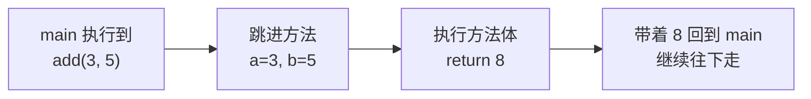

# Day 3 · 方法与数组

> 📅 阶段一：语法速过 ｜ ⏱ 建议用时：1.5~2 小时 ｜ 💻 今天的练习会直接复用昨天的猜数字

## 🎯 今日目标

1. 会把一段逻辑包装成**方法**，重复使用
2. 会用**数组**存一批数据，并遍历、统计
3. 写出一个「班级成绩统计器」

## ⚡ 知识点速览

### 方法：给一段代码起名字

昨天猜数字的 main 里堆了几十行代码。如果想让「猜一局」重复玩，总不能复制粘贴 —— 把它包成**方法**：

```java
public class GuessNumber {

    // 方法五要素：修饰符 返回类型 方法名(参数列表) { 方法体 }
    static int playOneRound() {
        int answer = (int) (Math.random() * 100) + 1;
        Scanner sc = new Scanner(System.in);
        int count = 0;
        while (true) {
            System.out.print("猜（1-100）：");
            int guess = sc.nextInt();
            count++;
            if (guess == answer) {
                System.out.println("猜中！用了 " + count + " 次");
                return count;          // return：结束方法，并把 count 交出去
            } else if (guess > answer) {
                System.out.println("大了");
            } else {
                System.out.println("小了");
            }
        }
    }

    public static void main(String[] args) {
        int total = playOneRound();    // 调用：名字 + 括号
        System.out.println("历史成绩：" + total + " 次");
    }
}
```

要点（现在阶段）：

- 方法写在**类里面、main 外面**，和 main 平级
- `static` 暂时无脑加上（main 是 static 的，只能直接调 static 方法），Day 4 讲清它
- 返回类型：要交出什么类型就写什么（`int`、`double`、`String`…）；什么都不交就写 `void`
- **参数**是方法的「原料」：

```java
static int add(int a, int b) {     // 收两个 int
    return a + b;                  // 交出一个 int
}
// 调用：int sum = add(3, 5);      // sum = 8
```

调用的执行流程：



### 数组：一排带编号的储物柜

```java
int[] scores = new int[5];          // 造 5 个连排的 int 柜子，编号 0~4
scores[0] = 90;                     // 往 0 号柜放东西
scores[1] = 75;

int[] nums = {90, 75, 88, 60, 100}; // 创建时直接装好

System.out.println(nums.length);    // 5，柜子总数（注意没有括号）
System.out.println(nums[0]);        // 90，第一个元素

// 遍历方式一：普通 for（要用下标时）
for (int i = 0; i < nums.length; i++) {
    System.out.println("第 " + i + " 号柜：" + nums[i]);
}

// 遍历方式二：增强 for（只要值、不要下标时）
for (int n : nums) {
    System.out.println(n);
}
```

> ⚠️ 最著名的错误 —— 数组越界：柜子只有 5 个，访问 `nums[5]` 会抛 `ArrayIndexOutOfBoundsException`。下标从 **0** 开始，最大是 `length - 1`。

内存里长这样：

```
nums  ──→  [ 90 | 75 | 88 | 60 | 100 ]
            [0]  [1]  [2]  [3]  [4]
```

## 💻 跟着写

### 练习 1：重构猜数字（跟打 + 理解，约 25 分钟）

把昨天的猜数字改造成上面的结构，并加一个「玩多局取最好成绩」的 main：

```java
public static void main(String[] args) {
    Scanner sc = new Scanner(System.in);
    int best = 999;                       // 记录最好（最少次数）成绩
    while (true) {
        int used = playOneRound();
        if (used < best) {
            best = used;
            System.out.println("🎯 新纪录！");
        }
        System.out.print("再来一局吗？(y/n)：");
        String again = sc.next();
        if (!again.equals("y")) {
            System.out.println("最好成绩：" + best + " 次，再见！");
            break;
        }
    }
}
```

体会一下：`playOneRound` 这个名字让 main 读起来像在读需求。

### 练习 2：班级成绩统计器（核心练习，约 35 分钟）

需求：先输入班级人数 `n`，再输入 `n` 个成绩，然后输出：最高分、最低分、平均分、以及每个低于平均分的成绩。把统计逻辑做成方法：

```java
import java.util.Scanner;

public class ScoreStats {
    public static void main(String[] args) {
        Scanner sc = new Scanner(System.in);
        System.out.print("班级人数：");
        int n = sc.nextInt();

        int[] scores = new int[n];
        for (int i = 0; i < n; i++) {           // TODO ①：逐个录入
            System.out.print("第 " + (i + 1) + " 个人的成绩：");
            // ...
        }

        int max = maxOf(scores);                 // TODO ②：实现下面三个方法
        int min = minOf(scores);
        double avg = avgOf(scores);

        System.out.printf("最高 %d，最低 %d，平均 %.1f%n", max, min, avg);

        System.out.print("低于平均分的：");
        for (int s : scores) {
            // TODO ③：低于 avg 的打印出来
        }
    }

    static int maxOf(int[] arr) {
        // 提示：先假设 arr[0] 最大，再逐个挑战擂主
        return 0;
    }

    static int minOf(int[] arr) {
        return 0;
    }

    static double avgOf(int[] arr) {
        // 提示：注意整数除法！总分会很大，用 double 接住
        return 0;
    }
}
```

### 练习 3：数组翻转（独立，约 15 分钟）

写方法 `static int[] reverse(int[] arr)`，返回倒序的新数组。测一测 `{1,2,3,4,5}` → `{5,4,3,2,1}`。

## 🧠 费曼时刻

**教学卡片**：

```markdown
## Day 3 教学卡片：方法与数组
- 用「菜谱/机器」的类比讲方法：原料是什么？成品是什么？void 是什么意思？
- 数组的下标为什么最大是 length - 1？
- 「擂台法」找最大分的思路，讲给不懂的人听
- 我讲卡壳的地方：
```

## ✅ 自测清单

- [ ] 能不看资料写出一个「两个参数、有返回值」的方法
- [ ] 知道 `void` 和 `return` 分别什么意思
- [ ] 成绩统计器跑通，三个统计方法都是自己实现的
- [ ] 见到 `ArrayIndexOutOfBoundsException` 知道第一反应查什么（下标越界）
- [ ] 完成了今天的教学卡片

---
[⬅️ 上一天](day02-流程控制.md) ｜ [🏠 返回首页](/) ｜ [下一天：类与对象 ➡️](day04-类与对象.md)
