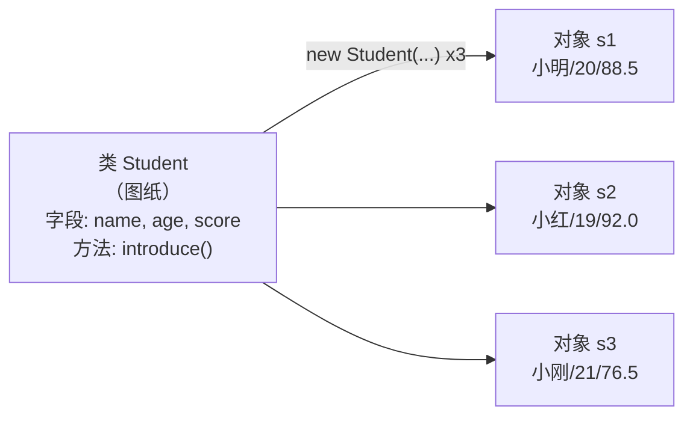
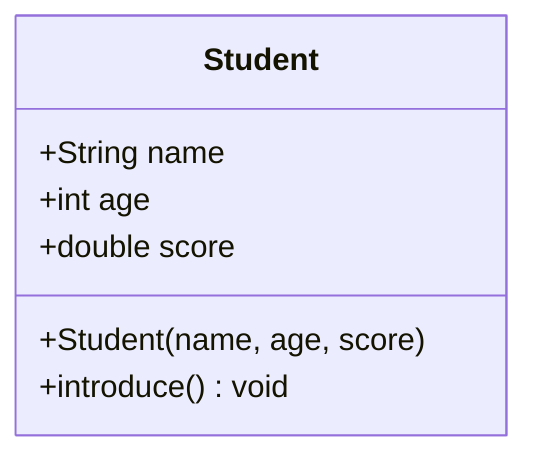

# Day 4 · 类与对象

> 📅 阶段一：语法速过 ｜ ⏱ 建议用时：1.5~2 小时 ｜ 💻 Java 的灵魂登场 —— 面向对象

## 🎯 今日目标

1. 理解**类**和**对象**的关系（图纸 vs 房子）
2. 会定义类（字段 + 方法）、用 `new` 创建对象
3. 设计出自己的 `Student` 类 —— 它将直接用于 5 天后的实战项目

## ⚡ 知识点速览

### 为什么需要类？

用昨天的知识存 3 个学生的信息，你得开一堆零散变量：

```java
String name1 = "小明"; int age1 = 20; double score1 = 88.5;
String name2 = "小红"; int age2 = 19; double score2 = 92.0;
String name3 = "小刚"; int age3 = 21; double score3 = 76.5;
// 想加第 4 个学生？再开 3 个变量… 想写「打印某个学生」的逻辑？参数要传 3 个…
```

数据散落一地，人和数据没有绑定。**类**把「一个学生有什么（字段）+ 能干什么（方法）」打包到一个盒子里：

```java
public class Student {
    // 字段（有什么）—— 和声明变量一个写法，只是写在类里、方法外
    String name;
    int age;
    double score;

    // 构造方法（怎么造）—— 名字必须和类同名，没有返回类型
    Student(String name, int age, double score) {
        this.name = name;        // this.name 是字段，name 是参数
        this.age = age;
        this.score = score;
    }

    // 方法（能干什么）
    void introduce() {
        System.out.printf("我是 %s，%d 岁，成绩 %.1f%n", name, age, score);
    }
}
```

### 使用：new 出对象

```java
public class School {
    public static void main(String[] args) {
        Student s1 = new Student("小明", 20, 88.5);   // 按图纸盖了一栋房子
        Student s2 = new Student("小红", 19, 92.0);

        s1.introduce();          // 用 . 调用对象的方法
        s2.introduce();
        System.out.println(s1.name);   // 用 . 访问字段
    }
}
```

> 💡 一个 Java 文件里只能有**一个 public 类**，文件名与它同名。习惯：一个类一个文件。`main` 放在另一个类里（如 `School`）。

### 图纸与房子



类是模板，对象是照着模板造出来的一个个实体；**字段装在每个对象身上，各存各的**。

用类图描述（UML 标准画法，看懂即可，后面还会见到）：



### 顺便：昨天欠的账

- `static` 的意思：属于**类**而不是某个对象。`main` 是程序入口，不依附任何对象，所以是 static —— 这也解释了 Day 3 里「main 里直接调的方法要加 static」。
- 每个类不写构造方法时，Java 送一个空的默认构造（`new Student()` 那种）。一旦自己写了带参构造，默认的就没了。
- `System.out.println(s1)` 默认打印类似 `Student@1b6d3586`（类名@地址），想让打印更友好，给类加 `toString()` 方法，Day 5 练。

## 💻 跟着写

### 练习 1：Student 类（跟打，约 20 分钟）

新建两个类文件 `Student.java`、`School.java`，敲上面两段代码并运行。

### 练习 2：升级 Student（半独立，约 25 分钟）

给 `Student` 增加功能：

1. 新增字段 `int id`（学号），构造方法同步加参数
2. 新增方法 `boolean isExcellent()`：成绩 >= 90 返回 `true`
3. 新增方法 `double getGap(double target)`：返回成绩与目标分的差距
4. 在 `School` 的 main 里创建 3 个学生，循环调用 `introduce()`，并打印「优秀名单」

```java
Student[] all = { s1, s2, s3 };     // 数组里装的也可以是对象
for (Student s : all) {
    if (s.isExcellent()) {
        System.out.println("优秀：" + s.name);
    }
}
```

> 注意体会：`s.name` 直接访问字段在语法上可行，但 Day 5 会告诉你为什么这是坏习惯。

### 练习 3：Book 类（独立设计，约 25 分钟）

不看任何参考，从零设计 `Book` 类：字段自定（书名、价格、作者…至少 3 个），构造方法 1 个，方法至少 2 个（比如 `打印信息`、`是否打折`），再写 `Library` 类的 main 创建 3 本书并测试。

**这就是「面向对象设计」的第一次实战：你决定这个类有什么、能干嘛。**

## 🧠 费曼时刻

**教学卡片**：

```markdown
## Day 4 教学卡片：类与对象
- 用一个生活类比讲「类 vs 对象」（图纸/房子？模具/月饼？）
- this 是什么？什么时候必须写？
- 构造方法和普通方法，3 个区别？
- 为什么把数据和操作数据的方法打包在一起，比散装变量好？
- 我讲卡壳的地方：
```

## ✅ 自测清单

- [ ] 能口头说清类和对象的区别，并举一个自己的类比
- [ ] 能默写一个「3 字段 + 构造方法 + 1 普通方法」的类
- [ ] Student 升级练习完成，优秀名单输出正确
- [ ] 独立设计出了 Book 类并通过测试
- [ ] 完成了今天的教学卡片

---
[⬅️ 上一天](day03-方法与数组.md) ｜ [🏠 返回首页](/) ｜ [下一天：封装继承多态 ➡️](day05-封装继承多态.md)
