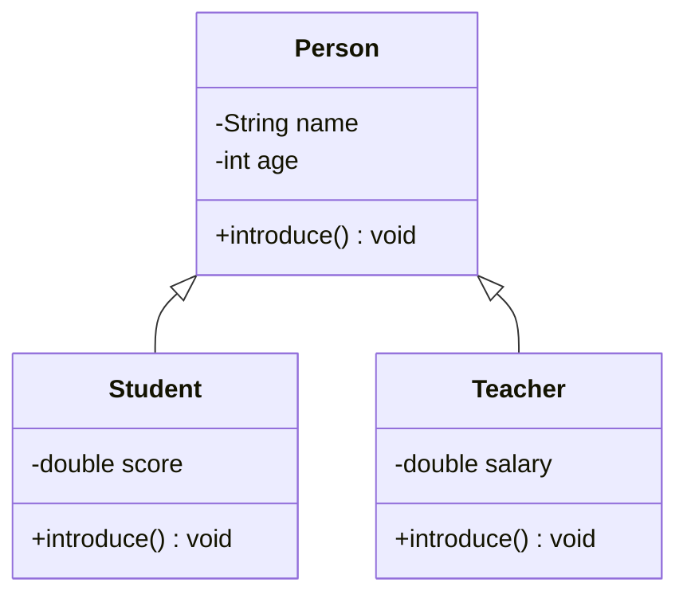

# Day 5 · 封装继承多态

> 📅 阶段一：语法速过 ｜ ⏱ 建议用时：2 小时 ｜ 💻 面向对象三大特性，一次讲完

## 🎯 今日目标

1. **封装**：字段私有 + getter/setter，知道为什么
2. **继承**：子类复用父类的字段和方法
3. **多态**：同一条调用语句，跑出不同的行为

这仨词听着唬人，其实各解决一个具体问题：

| 特性 | 解决什么问题 | 一句话 |
|---|---|---|
| 封装 | 数据被人随手改坏 | 藏好内部，只留正规入口 |
| 继承 | 两个类大量重复代码 | 把公共部分抽给父类 |
| 多态 | 同一逻辑要处理多种类型 | 父类统一接收，运行时各显神通 |

## ⚡ 知识点速览

### 封装：private + getter/setter

昨天我们直接 `s1.score = 999;` 就把成绩改了 —— 万一有人写 `s1.age = -50` 呢？**把字段设为 `private`（仅本类可见），外界只能走公开的方法**：

```java
public class Student {
    private String name;
    private int age;
    private double score;

    public Student(String name, int age, double score) {
        this.name = name;
        setAge(age);          // 构造里也走校验，一箭双雕
        setScore(score);
    }

    // getter：读
    public String getName() { return name; }

    // setter：写，顺便守门
    public void setAge(int age) {
        if (age < 0 || age > 150) {
            System.out.println("⚠️ 年龄不合法，保持原值");
            return;
        }
        this.age = age;
    }

    public void setScore(double score) {
        if (score < 0 || score > 100) {
            System.out.println("⚠️ 成绩不合法，保持原值");
            return;
        }
        this.score = score;
    }
    // getAge()、getScore() 自己补
}
```

> 💡 IDEA 秒生成：类里右键 → Generate → Getter and Setter。生成后自己往 setter 里加校验。

### 继承：extends

学生和老师都有姓名、年龄，都能自我介绍 —— 把公共部分抽到父类 `Person`：

```java
public class Person {
    private String name;
    private int age;

    public Person(String name, int age) { this.name = name; this.age = age; }

    public String getName() { return name; }
    public int getAge() { return age; }

    public void introduce() {
        System.out.printf("我是 %s，%d 岁", name, age);
    }
}
```

```java
public class Student extends Person {          // Student 继承 Person
    private double score;

    public Student(String name, int age, double score) {
        super(name, age);                      // 调父类构造，先造好“人”的部分
        this.score = score;
    }

    public double getScore() { return score; }

    @Override                                   // 重写：覆盖父类的 introduce
    public void introduce() {
        super.introduce();                      // 复用父类的打印
        System.out.printf("，是一名学生，成绩 %.1f%n", score);
    }
}
```

要点：

- `extends` 继承，子类**自动拥有**父类的非 private 成员（name 虽是 private，但通过继承来的 `getName()` 能访问）
- `super(...)` 调父类构造，必须是子类构造的第一行
- `@Override` 注解：告诉编译器「我在重写父类方法」，写错方法名会直接报错，是防呆神器
- Java 单继承：一个类只能有一个直接父类

### 多态：父类的引用，子类的行为

```java
Person p = new Student("小明", 20, 88.5);   // 父类引用指向子类对象，合法！
p.introduce();    // 调的是 Student 重写后的版本 —— 这就是多态
```

最实用的场景 —— **一个数组/循环统一处理混合类型**：

```java
Person[] crowd = {
    new Student("小明", 20, 88.5),
    new Teacher("王老师", 35, 8000),
    new Student("小红", 19, 92.0)
};
for (Person p : crowd) {
    p.introduce();     // 同一句话，各有各的执行结果
}
```

继承关系一张图：



### 顺手学一个：重写 toString()

让对象能被友好打印（覆盖 Object 类自带的方法，也是多态的例子）：

```java
// 放进 Student 类
@Override
public String toString() {
    return String.format("Student{name=%s, age=%d, score=%.1f}", getName(), getAge(), score);
}
```

之后 `System.out.println(student)` 就会打印这个格式，而不是 `Student@1b6d3586`。**实战项目会大量用到。**

## 💻 跟着写

### 练习 1：Person 家族（跟打，约 30 分钟）

建 4 个类：`Person`、`Student`、`Teacher`、`Campus`（含 main）。把上面的代码全部敲完跑通，最后 `Campus` 里用 `Person[]` 数组循环 `introduce()`，观察多态效果。

### 练习 2：加固 Student（半独立，约 20 分钟）

1. 给 `Teacher` 加 `salary` 字段和校验（不能为负）
2. 给 `Student` 重写 `toString()`
3. 给 `Person` 加方法 `greet()`，子类不重写直接用 —— 体会「继承来的白拿」

### 练习 3：图形面积（独立，约 30 分钟）

设计：抽象出 `Shape` 类（字段：名称），子类 `Circle`（半径）和 `Rect`（宽、高）。每个子类实现 `double area()` 方法。main 里建 `Shape[]` 存一个圆一个矩形，循环打印每个图形的名称和面积。

<details>
<summary>💡 卡住了？看一眼骨架（先自己试 15 分钟）</summary>

```java
class Shape {
    protected String name;                  // protected：子类可直接用
    public Shape(String name) { this.name = name; }
    public double area() { return 0; }      // 父类给个默认实现
}
// Circle extends Shape：构造方法收半径，重写 area 返回 Math.PI * r * r
// Rect extends Shape：重写 area 返回 width * height
```
</details>

## 🧠 费曼时刻

今天概念最密，费曼输出也最值钱。

**教学卡片**：

```markdown
## Day 5 教学卡片：三大特性
- 封装：为什么字段要 private？用“银行账户不能让人直接改余额”讲一遍
- 继承：什么时候值得抽父类？super 什么时候用？
- 多态：用 today 的 Campus 例子讲“为什么同一个 p.introduce() 输出不一样”
- 三大特性分别解决什么问题（各一句话）
- 我讲卡壳的地方：
```

> 🎯 检验标准：能不看任何材料，给朋友讲清「为什么 p.introduce() 会调到子类版本」。讲得清，说明今天的饭吃下了。

## ✅ 自测清单

- [ ] 会用 IDEA 生成 getter/setter，并知道校验写在 setter 里
- [ ] 能写出「子类构造调用 super」的标准代码
- [ ] 能解释 `@Override` 的作用和好处
- [ ] Person 家族练习跑通，能指着输出说出哪行体现了多态
- [ ] 图形面积独立完成
- [ ] 完成了今天的教学卡片

---
[⬅️ 上一天](day04-类与对象.md) ｜ [🏠 返回首页](/) ｜ [下一天：接口与常用类 ➡️](day06-接口与常用类.md)
