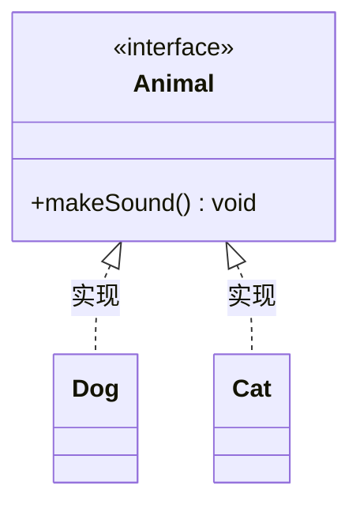

# Day 6 · 接口与常用类

> 📅 阶段一：语法速过 ｜ ⏱ 建议用时：1.5~2 小时 ｜ 💻 上半天讲接口，下半天玩字符串

## 🎯 今日目标

1. 理解**接口**是「行为约定」，会定义和实现接口
2. 熟练使用 `String` 常用方法，彻底避开 `==` 比较
3. 会用 `StringBuilder` 拼接大量字符串

## ⚡ 知识点速览

### 接口：只规定「能干什么」，不管「怎么干」

继承解决「是什么」（学生是人），接口解决「会什么」（会游泳、能比较大小）：

```java
public interface Animal {
    void makeSound();        // 只有声明，没有方法体 —— 约定：会叫，怎么叫你说了算
}
```

注意：接口不是类，**不能用 `extends` 去继承它**，而是用 `implements` 来实现（Java 类只能继承一个父类，但可以实现多个接口 —— 这是接口的杀手锏）：

```java
public class Dog implements Animal {
    @Override
    public void makeSound() { System.out.println("汪汪！"); }
}

public class Cat implements Animal {
    @Override
    public void makeSound() { System.out.println("喵~"); }
}
```

接口同样能吃到多态的红利：

```java
Animal[] zoo = { new Dog(), new Cat(), new Dog() };
for (Animal a : zoo) {
    a.makeSound();          // 各叫各的
}
```



> 💡 现阶段把接口理解为「能力清单」就够了。明天见到的 `List`、`ArrayList` 就是「接口 + 实现类」的黄金组合：`List<String> list = new ArrayList<>();` —— 左边是约定，右边是具体实现，Day 11 重构实战项目时会真正尝到甜头。

### String 常用方法（背下这张表，够用很久）

```java
String s = "Hello, Java";

s.length()               // 11        长度（这次有括号！数组 length 没有括号）
s.equals("hello, java")  // false     内容比较
s.equalsIgnoreCase(...)  // 忽略大小写比较
s.charAt(0)              // 'H'       取第 i 个字符
s.indexOf("Java")        // 7         找子串位置，找不到返回 -1
s.contains("llo")        // true      是否包含
s.substring(7)           // "Java"    从下标 7 截到末尾
s.substring(0, 5)        // "Hello"   从 0 截到 5（含头不含尾）
s.toUpperCase()          // "HELLO, JAVA"
s.trim()                 // 去掉两端空格
"a,b,c".split(",")       // ["a","b","c"] 按分隔符拆成数组（Day 12 存档文件要用！）
String.valueOf(123)      // "123"     其他类型转字符串
```

> ⚠️ **String 是不可变的**：所有「修改」方法都返回**新字符串**，必须接住返回值！
> ```java
> s.toUpperCase();        // ❌ 白调，s 没变
> s = s.toUpperCase();    // ✅ 接住新值
> ```

### == vs equals（本计划第二次强调，因为它值得）

```java
String a = "java";
String b = "java";
String c = new String("java");

a == b              // true  —— 恰好同用一个常量池对象，纯属运气
a == c              // false —— == 比较的是「是不是同一个对象」（内存地址）
a.equals(c)         // true  —— equals 比较的是「内容是否相同」
```

结论：**比较字符串，永远用 `.equals()`**，一次例外都不要有。

### StringBuilder：循环里拼字符串的正确姿势

```java
// ❌ 循环中用 + 拼接：每次都造新字符串，浪费
String result = "";
for (int i = 1; i <= 100; i++) {
    result = result + i + ",";
}

// ✅ StringBuilder：可变的字符串缓冲区
StringBuilder sb = new StringBuilder();
for (int i = 1; i <= 100; i++) {
    sb.append(i).append(",");
}
String result = sb.toString();
```

常用就三招：`append(...)` 追加、`reverse()` 反转、`toString()` 交货。

## 💻 跟着写

### 练习 1：会唱歌的程序员（跟打，约 20 分钟）

定义接口 `Singer`（方法 `void sing()`），让 `Student` 和 `Teacher` 都 `implements Singer`（能力与血统无关！），main 里建 `Singer[]` 合唱团统一开嗓。

### 练习 2：手机号脱敏（半独立，约 20 分钟）

输入完整手机号 `13812345678`，输出 `138****5678`。

提示：`substring` 取前 3 位和后 4 位，中间拼 `"****"`。再进阶：先校验长度是不是 11 位，不是就提示重新输入（`while` + `length()`）。

### 练习 3：字符串工具箱（独立，约 35 分钟）

写工具类 `StrUtils`，实现并测试下面每个 static 方法：

1. `static boolean isPalindrome(String s)`：判断回文（如 `level`、`上海自来水来自海上`）
   提示：双下标 `i` 从头走、`j` 从尾走，逐个比对 `charAt`
2. `static int countChar(String s, char c)`：统计某字符出现次数（`charAt` + 循环）
3. `static String reverseWords(String s)`：把 `"hello world java"` 反转成 `"java world hello"`
   提示：`split(" ")` 拆开，倒序拼回（可体会 StringBuilder 的好用）

## 🧠 费曼时刻

**教学卡片**：

```markdown
## Day 6 教学卡片：接口与字符串
- 接口和继承，各管什么？用「血缘 vs 技能」讲一遍
- 为什么 List<String> list = new ArrayList<>() 左右两边类型可以不一样？（能说个大概就行）
- 为什么 String 的“修改”方法必须接返回值？
- == 和 equals 的区别，用一个类比讲（同卵双胞胎 vs 长得一样的陌生人？）
- 我讲卡壳的地方：
```

## ✅ 自测清单

- [ ] 能写出「接口 + 2 个实现类 + 多态调用」的完整代码
- [ ] String 常用方法表格里的方法，能盲写 6 个以上
- [ ] 手机号脱敏完成，且带长度校验
- [ ] 回文判断写出来了（双下标思路能讲清）
- [ ] 完成了今天的教学卡片

---
[⬅️ 上一天](day05-封装继承多态.md) ｜ [🏠 返回首页](/) ｜ [下一天：异常与集合 ➡️](day07-异常与集合.md)
