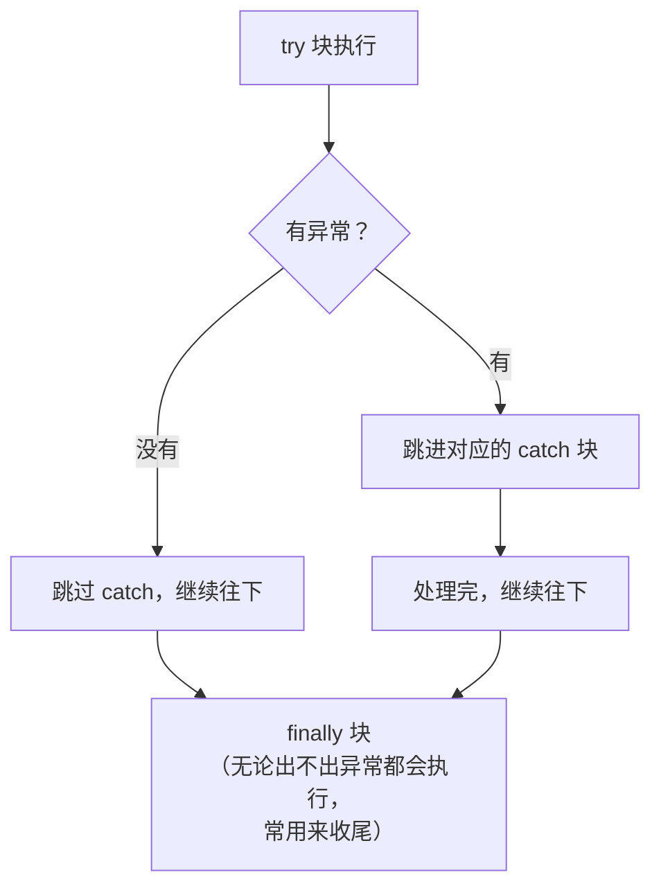
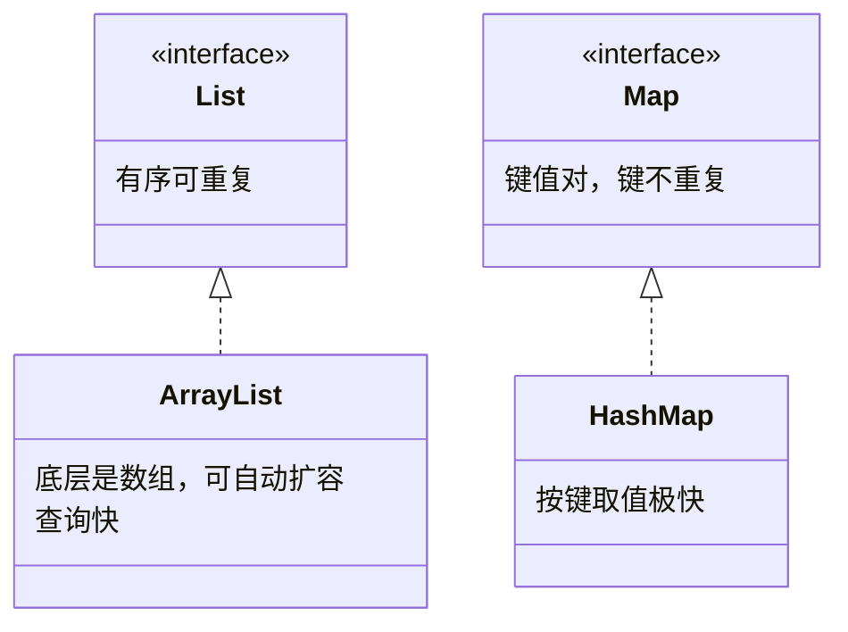

# Day 7 · 异常与集合

> 📅 阶段一：语法速过 ｜ ⏱ 建议用时：2 小时 ｜ 💻 今天的成果将直接搬进实战项目

## 🎯 今日目标

1. 会用 `try-catch` 接住异常，让程序「打不死」
2. 会用 `ArrayList` 替代数组存动态数据
3. 会用 `HashMap` 做键值统计
4. 写出 `readInt` 安全输入方法（实战项目的基石）

## ⚡ 知识点速览

### 异常：程序抛出的「求救信号」

前面你一定见过这些红色报错：输错类型、数组越界、除以零…… 它们叫**异常（Exception）**。不处理，程序当场崩溃；用 `try-catch` 接住，程序就能活下去：

```java
try {
    int age = sc.nextInt();          // 危险代码放 try 里
    System.out.println("明年 " + (age + 1) + " 岁");
} catch (InputMismatchException e) {  // 类型对上了就接住
    System.out.println("⚠️ 请输入数字！");
    sc.next();                        // ⚠️ 关键：把读错的脏数据吃掉，否则死循环
}
```



常见异常脸熟即可（`InputMismatchException` 输入类型不匹配、`NumberFormatException` 数字格式错、`ArithmeticException` 除零、`IndexOutOfBoundsException` 越界、`NullPointerException` 空指针 —— 空指针是 Java 界第一大异常，后面天天见）。

### 集合：会自动「长大」的数组

数组的长度定死不能变，装学生很别扭（Day 10 你会亲手痛一次）。集合框架登场，先认识两个最常用的：



**ArrayList —— 动态数组：**

```java
import java.util.ArrayList;
import java.util.List;

List<String> names = new ArrayList<>();   // 存 String 的列表；左边接口右边实现（Day 6 伏笔回收）

names.add("小明");                        // 尾部追加，不用管容量
names.add("小红");
names.add("小明");                        // 允许重复

names.get(0)                             // "小明"，下标访问，同样从 0 开始
names.set(1, "小刚");                     // 改写 1 号位
names.remove(0);                          // 删除（自动把后面的往前挪！）
names.size()                              // 当前个数（注意：不是 length）
names.contains("小刚")                     // 是否包含
names.isEmpty()                           // 是否为空

for (String n : names) {                  // 增强for遍历，数组同款
    System.out.println(n);
}
```

**HashMap —— 键值对（像字典：查「键」得「值」）：**

```java
import java.util.HashMap;
import java.util.Map;

Map<String, Integer> stock = new HashMap<>();   // 键：商品名，值：库存

stock.put("苹果", 30);          // 存/改
stock.put("香蕉", 12);

stock.get("苹果")              // 30；键不存在返回 null
stock.getOrDefault("梨", 0)    // 0：不存在就给默认值（统计计数神器）

for (Map.Entry<String, Integer> e : stock.entrySet()) {   // 遍历键值对
    System.out.println(e.getKey() + " 库存：" + e.getValue());
}
```

### 泛型速览（30 秒版）

`List<String>`、`Map<String, Integer>` 尖括号里的东西叫**泛型**：**规定这个容器只能装什么类型**。好处是编译器帮你把关 —— `List<String>` 里 `add(123)` 直接编译报错，不用等运行时炸。现阶段会用、见到不慌即可。

## 💻 跟着写

### 练习 1：readInt 安全输入（跟打，项目基石，约 25 分钟）

需求：无论用户输什么（文字、空行、乱码），都循环要求直到拿到合法整数，且支持范围校验：

```java
import java.util.InputMismatchException;
import java.util.Scanner;

public class InputHelper {

    static int readInt(Scanner sc, String prompt, int min, int max) {
        while (true) {
            System.out.print(prompt);
            try {
                int value = sc.nextInt();
                if (value < min || value > max) {
                    System.out.println("⚠️ 请输入 " + min + " ~ " + max + " 之间的数");
                    continue;
                }
                return value;
            } catch (InputMismatchException e) {
                System.out.println("⚠️ 那不是数字，再来一次");
                sc.next();               // 吃掉脏输入，这行忘写就死循环
            }
        }
    }

    public static void main(String[] args) {
        Scanner sc = new Scanner(System.in);
        int age = readInt(sc, "请输入年龄（1-120）：", 1, 120);
        System.out.println("收到年龄：" + age);
    }
}
```

存好这个类，**Day 13 实战项目直接搬去用**。故意输 `abc`、`3.14`、`999` 测它。

### 练习 2：成绩册 v2（核心练习，约 30 分钟）

用 `ArrayList<Double>` 重做 Day 3 的成绩统计：

- 循环读入成绩，输入 `-1` 结束（不再需要先问人数！体会集合的优势）
- 输出：人数、平均分、最高分、以及所有不及格（< 60）的成绩
- 提示：`Collections.max(list)`、`Collections.min(list)` 可以白嫖最大最小（`import java.util.Collections;`）

### 练习 3：单词计数（独立，约 25 分钟）

输入一句话如 `to be or not to be`，用 `split(" ")` 拆词，输出每个单词出现次数：

```
to=2  be=2  or=1  not=1
```

提示：`Map<String, Integer>`，遍历单词时 `map.put(word, map.getOrDefault(word, 0) + 1)`（一行顶十行的统计套路）。

## 🧠 费曼时刻

**教学卡片**：

```markdown
## Day 7 教学卡片：异常与集合
- try-catch 像「装了安全气囊的车」，展开讲讲
- catch 里那行 sc.next() 是干嘛的？删了会怎样？
- ArrayList 和数组比，好在哪？给一个“非用 ArrayList 不可”的场景
- HashMap 像 X（字典？手机通讯录？），put 和 get 分别对应什么动作？
- 我讲卡壳的地方：
```

## ✅ 自测清单

- [ ] 能白板写出 try-catch 结构，说出 finally 的特点
- [ ] readInt 测过 3 种非法输入，都稳如老狗
- [ ] 成绩册 v2 完成，不用先问人数就能录入
- [ ] 单词计数输出正确
- [ ] 能说出 `size()` / `length` / `length()` 分别属于谁
- [ ] 完成了今天的教学卡片

---
[⬅️ 上一天](day06-接口与常用类.md) ｜ [🏠 返回首页](/) ｜ [下一天：文件 IO ➡️](day08-文件IO与泛型速览.md)
