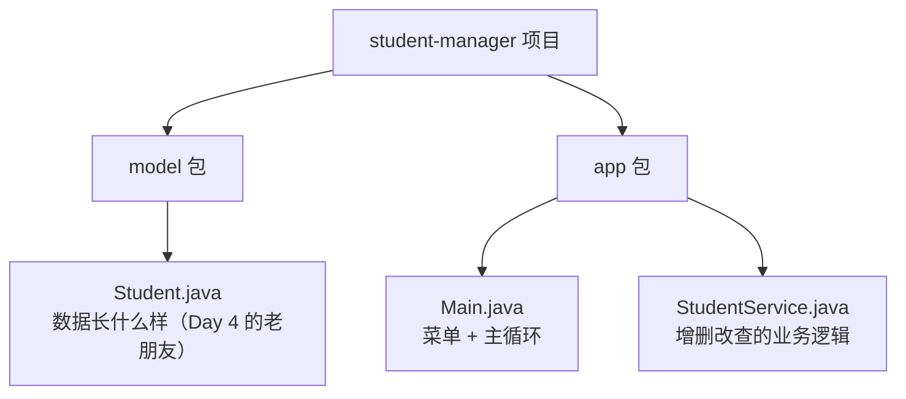
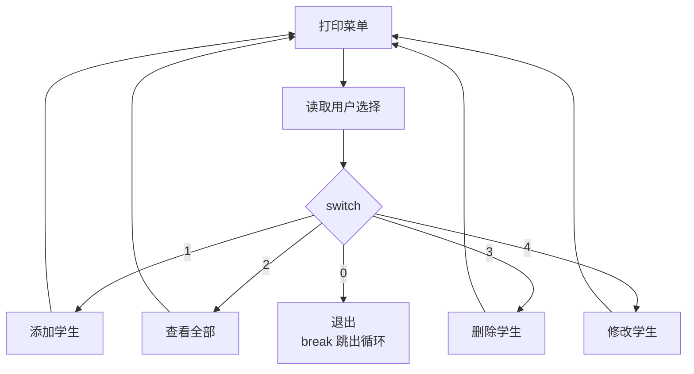

# Day 9 · 项目启动：菜单骨架

> 📅 阶段二：项目实战（Day 9–14） ｜ ⏱ 建议用时：1.5 小时 ｜ 🚀 从今天起，你在写一个「软件」

## 🎯 今日目标

1. 明确系统需求，规划项目结构
2. 搭好「能循环显示菜单、能退出」的程序骨架
3. 建立「每天运行、每天提交」的开发节奏

## ⚡ 知识点速览

### 需求分析：这个系统要干什么？

**学生管理系统（控制台版）**，用户是班主任。功能清单：

| 编号 | 功能 | 说明 | 完成于 |
|---|---|---|---|
| F1 | 添加学生 | 录入学号、姓名、年龄、成绩 | Day 10 |
| F2 | 查看全部 | 打印所有学生 | Day 10 |
| F3 | 删除学生 | 按学号删除 | Day 10 |
| F4 | 修改学生 | 按学号找到后改信息 | Day 10 |
| F5 | 查询单个 | 按学号精查 + 按姓名模糊查 | Day 11 |
| F6 | 数据存档 | 关闭程序数据不丢 | Day 12 |
| F7 | 输入校验 | 非法输入不崩溃、不进库 | Day 13 |

### 项目结构：分而治之

不把所有代码堆一个文件，按职责分包（package，相当于文件夹）：



```text
student-manager/
└── src/
    ├── model/
    │   └── Student.java
    └── app/
        ├── Main.java
        └── StudentService.java
```

> 💡 IDEA 里新建包：`src` 右键 → New → Package。注意：有包的类，文件第一行要有 `package model;`，IDEA 自动生成；跨包引用要 `import model.Student;`。

### 主循环：交互程序的「心跳」

所有控制台程序都是一个死循环：**显示菜单 → 读选择 → 分发执行 → 回到菜单**，直到用户选择退出：



今天的骨架里 1~4 先打印「功能开发中…」，**先跑通骨架，再逐个填充** —— 这是真实软件开发的节奏（迭代）。

## 💻 跟着写

### 任务 1：建项目与类（约 15 分钟）

1. IDEA 新建项目 `student-manager`（JDK 21）
2. 在 `src` 下建包 `model` 和 `app`
3. `model.Student`：把 Day 5 的版本搬进来（private 字段 + 构造 + getter/setter + `toString`）
4. `app.Main`、`app.StudentService` 先建空类

### 任务 2：菜单骨架（核心，约 40 分钟）

`Main.java` 完整骨架（今天全文给出，从明天起只给提示）：

```java
package app;

import java.util.Scanner;

public class Main {
    public static void main(String[] args) {
        Scanner sc = new Scanner(System.in);

        System.out.println("===== 欢迎使用学生管理系统 =====");

        while (true) {
            System.out.println();
            System.out.println("--------- 菜单 ---------");
            System.out.println("1. 添加学生");
            System.out.println("2. 查看全部学生");
            System.out.println("3. 删除学生");
            System.out.println("4. 修改学生信息");
            System.out.println("0. 退出系统");
            System.out.print("请选择：");

            String choice = sc.next();          // 读字符串再比较，避免输字母直接崩

            switch (choice) {
                case "1" -> System.out.println("【添加】功能开发中…");
                case "2" -> System.out.println("【查看】功能开发中…");
                case "3" -> System.out.println("【删除】功能开发中…");
                case "4" -> System.out.println("【修改】功能开发中…");
                case "0" -> {
                    System.out.println("数据已保存（假装的，Day 12 变真），再见！");
                    return;                     // 直接结束 main
                }
                default -> System.out.println("⚠️ 没有这个选项，请输入 0-4");
            }
        }
    }
}
```

> 💡 `case "1" ->` 是 Java 14+ 的 switch 箭头语法，比老式的 `case 1: ... break;` 爽利，放心用。
> 💡 注意这里读选择用的是 `sc.next()` + 字符串比较（记得 `.equals`）而不是 `nextInt()` —— 用户输入 `abc` 时程序不会崩。这是**防御式设计**的第一课。

### 任务 3：跑通 + 建立节奏（约 15 分钟）

1. 运行，把 0~5 每个选项都按一遍，确认菜单循环和退出正常
2. **初始化 git**（如果还没有）：项目目录 `git init`，把 `student-manager` 提交一次
3. 以后每天完工都提交一次，commit message 写清楚，比如 `day9: 菜单骨架跑通` —— 6 天后你将拥有一份完整的「开发成长史」

> 💡 IDEA 的 `.idea/`、编译产物 `out/` 不要提交，加入 `.gitignore`。

## 🧠 费曼时刻

**教学卡片**：

```markdown
## Day 9 教学卡片：从需求到骨架
- 用 3 句话向班主任介绍这个系统将能做什么
- 为什么先搭“空壳菜单”而不是直接写添加功能？（“先跑起来再变强”）
- 主循环 + switch 为什么是所有控制台软件的心跳？
- package 是什么？解决了什么问题？
- 我讲卡壳的地方：
```

## ✅ 自测清单

- [ ] 需求表格 7 个功能都能复述
- [ ] 项目按 model/app 分包，Student 搬迁成功
- [ ] 菜单骨架跑通：非法选项有提示、0 能退出
- [ ] 完成第一次 git 提交
- [ ] 完成了今天的教学卡片

---
[⬅️ 上一天](day08-文件IO与泛型速览.md) ｜ [🏠 返回首页](/) ｜ [下一天：增删改查 ➡️](day10-增删改查.md)
