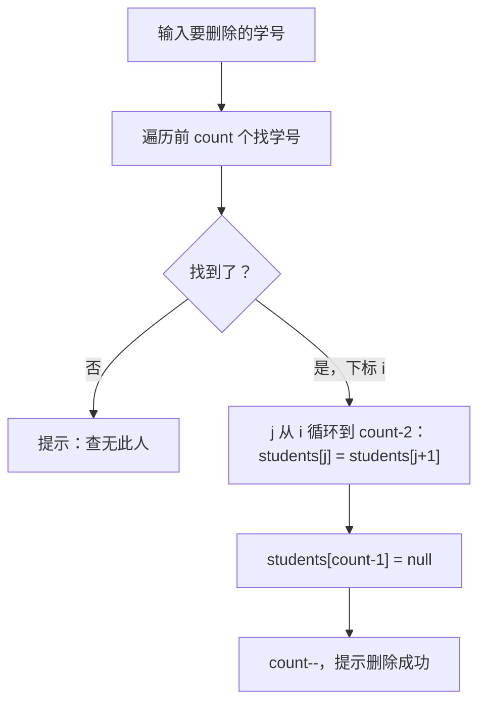

# Day 10 · 增删改查

> 📅 阶段二：项目实战 ｜ ⏱ 建议用时：2 小时 ｜ 💻 今天是体力+脑力双开的一天：四大功能全部落地

## 🎯 今日目标

1. 用**数组 + 计数器**实现：添加、查看全部、删除、修改
2. 亲手体会数组管理的痛苦（这是明天重构的最佳铺垫）
3. 养成「写一个功能 → 立刻测试」的习惯

## ⚡ 知识点速览

### 核心技巧：定长数组装不定长的数据

学生数量不固定，但数组长度定死。解法：开一个**够大的数组** + 一个**计数器**记录真实个数：

```java
Student[] students = new Student[100];   // 仓库最多 100 个
int count = 0;                           // 仓库里实际的个数

// 有效数据永远在 [0, count-1]，遍历只走前 count 个：
for (int i = 0; i < count; i++) { ... }
```

添加 = `students[count] = 新学生; count++;`（装进下一个空位）

### 删除：后面整体往前挪

数组中间不能掏洞，删除 = 把后面的元素依次往前挪一位，覆盖掉目标：

```
删除 2 号（小红）前：  [小明, 小红, 小刚, 小美, null]  count=4
                      [0]   [1]   [2]   [3]
操作：[2]=[3]（小美 覆盖 小刚），[3]=null，count--
删除后：              [小明, 小美, null, null, null]  count=3
```



### 查找：按学号定位（删除/修改的前置技能）

```java
int findIndexById(Student[] arr, int count, int id) {
    for (int i = 0; i < count; i++) {
        if (arr[i].getId() == id) {
            return i;        // 找到，返回下标
        }
    }
    return -1;               // 没找到，-1 是约定俗成的“不存在”
}
```

删除和修改都要先「按学号找到下标」，**一个 findIndexById 方法两处复用** —— 这就是 Day 3 方法抽象的红利。

### 数据放哪儿？

数组是 `StudentService` 的内部状态，main 每圈循环后数据还得在 —— 所以把数组做成**字段**：

```java
package app;

import model.Student;

public class StudentService {
    private Student[] students = new Student[100];
    private int count = 0;

    // 增删改查方法都写在这里，操作这两个字段
}
```

`Main` 里 `StudentService service = new StudentService();`（循环外创建一次），菜单分发时调用 `service.xxx()`。

## 💻 跟着写

按顺序实现，**每完成一个立刻运行测试**，别攒大招。

### 任务 1：添加学生（约 30 分钟）

`StudentService` 添加方法，提示词给出签名和行为：

```java
public void addStudent(Student s) {
    // TODO: 数组满了怎么办？（count == students.length）→ 提示“仓库已满”并 return
    // TODO: 学号重复怎么办？调 findIndexById 判重，重复则提示并 return
    // TODO: students[count] = s; count++; 成功提示
}
```

`Main` 的 `case "1"` 里：读学号/姓名/年龄/成绩 → `new Student(...)` → `service.addStudent(...)`。
（读数字还是用 `sc.nextInt()`？先让它崩，Day 13 统一换安全输入 —— **一次只解决一类问题**。）

测试点：正常添加 2 个；添加重复学号；添加 0 个直接查看（应为空）。

### 任务 2：查看全部（约 15 分钟）

```java
public void listAll() {
    // TODO: count == 0 → 打印“暂无学生，先添加吧”并 return
    // TODO: 打印表头后遍历 [0, count)，每行一个学生
    // TODO: 顺手统计平均分（有数据时）
}
```

打印格式自己定，比如用 printf 对齐：

```java
System.out.printf("%-6d %-8s %-4d %.1f%n", s.getId(), s.getName(), s.getAge(), s.getScore());
```

（`%-6d`：左对齐占 6 格宽；`%.1f`：一位小数。）

### 任务 3：删除学生（约 30 分钟）

按上面的流程图实现：

```java
public void removeStudent(int id) {
    // TODO: findIndexById 找下标，-1 → “查无此人”
    // TODO: 从 i 到 count-2 依次前移
    // TODO: 最后一位置 null，count--
}
```

测试点：删除中间位置的学生后 listAll 顺序正确；删除不存在的学号；把最后一个删掉；删到空再查看。

### 任务 4：修改学生（约 20 分钟）

```java
public void updateStudent(int id, Scanner sc) {
    // TODO: 找下标，-1 → “查无此人”
    // TODO: 打印原信息
    // TODO: 逐项读入新值（学号不变，改姓名/年龄/成绩），setter 存入
}
```

测试点：改完立刻查看确认；只改其中一项时其他项不被清空。

### 任务 5：收尾（约 10 分钟）

全部功能过一遍「添加 3 个 → 查看 → 修改 1 个 → 删除 1 个 → 查看」的完整流程，然后：

```bash
git add . && git commit -m "day10: 数组版增删改查完成"
```

## 🧠 费曼时刻

**教学卡片**：

```markdown
## Day 10 教学卡片：增删改查
- 「数组 + count」是怎么装下“不定长”数据的？画图讲
- 删除时为什么后面的元素要往前挪？挪完忘了 count-- 会怎样？
- findIndexById 为什么返回 -1 表示找不到？
- 今天哪个功能 bug 最多？我是怎么找到并修掉的？（讲修 bug 的过程比讲语法更值钱）
- 我讲卡壳的地方：
```

> 🎯 记录此刻的痛点：数组写删除挪动烦不烦？上限 100 个是不是很憋屈？**把这种难受写下来** —— 明天你将亲手用集合把它治好，对比之下终身难忘。

## ✅ 自测清单

- [ ] 四大功能全部可用，完整流程演示无 bug
- [ ] 学号重复添加会被拒绝
- [ ] 查看空列表有友好提示，不报错
- [ ] 删除中间元素后列表顺序正确
- [ ] git 已提交
- [ ] 完成了今天的教学卡片

---
[⬅️ 上一天](day09-项目启动.md) ｜ [🏠 返回首页](/) ｜ [下一天：集合重构 ➡️](day11-集合重构.md)
