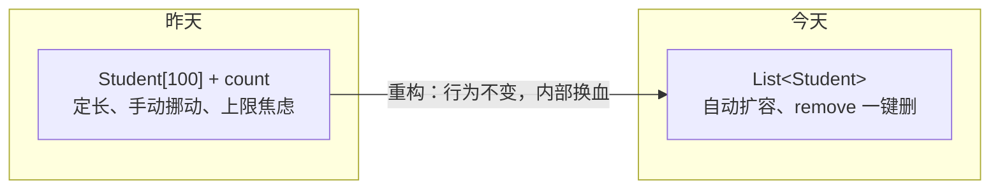

# Day 11 · 集合重构

> 📅 阶段二：项目实战 ｜ ⏱ 建议用时：1.5 小时 ｜ 💻 昨天有多痛，今天就有多爽

## 🎯 今日目标

1. 用 `ArrayList<Student>` 替换「数组 + count」，删除代码量骤减
2. 新增功能：按学号查单个、按姓名模糊查询
3. 理解**重构**：不改功能，只改内部实现

## ⚡ 知识点速览

### 什么是重构（Refactoring）？

**在不改变软件对外行为的前提下，优化内部结构。** 重构的前提是有验证手段 —— 所以每改一步都要跑一遍完整流程确认行为没变。

今天的重构地图：

| 昨天（数组版） | 今天（集合版） | 变化 |
|---|---|---|
| `Student[] students = new Student[100]` | `List<Student> students = new ArrayList<>()` | 无上限 |
| `int count` 手动维护 | `students.size()` | 少一个状态要操心 |
| 添加：判满 + `arr[count] = s` | `students.add(s)` | 一行 |
| 删除：循环前移 + 置 null + `count--` | `students.remove(对象或下标)` | 10 行 → 1 行 |
| 查找下标 | 遍历比对（依旧自己写，很快） | 基本不变 |

数据结构的变迁：



### 几个马上要用的 API 回顾（Day 7 老朋友）

```java
students.add(s);                   // 尾部添加
students.size();                   // 当前个数
students.get(i);                   // 按下标取
students.remove(i);                // 按下标删
students.remove(s);                // 按对象删（用得少，知道即可）
students.isEmpty();                // 是否为空
for (Student s : students) { }     // 遍历
```

> ⚠️ 一个经典坑：**一边增强 for 遍历一边 remove 会抛 `ConcurrentModificationException`**。删除的正确姿势：先遍历找到下标，循环结束后 `remove(下标)`；或者用普通 for 从后往前遍历删除。

### 模糊查询：contains

```java
// name.contains(keyword)：name 里是否包含关键词（Day 6 学过）
if (s.getName().contains(keyword)) { ... }
```

搜「小」能同时命中「小明」「小红」—— 这就是模糊查询的全部秘密。

## 💻 跟着写

### 任务 1：换血（约 30 分钟）

1. `StudentService` 字段替换：

```java
private final List<Student> students = new ArrayList<>();
// import java.util.List; import java.util.ArrayList;
```

2. 逐个方法改写，每改完一个就运行一遍增删改查全流程：
   - `addStudent`：去掉判满，保留**学号判重**（遍历用 `students.size()`）
   - `listAll`：`count == 0` 改成 `students.isEmpty()`；遍历换成增强 for
   - `findIndexById` → 改名 `findById`，直接**返回 `Student` 对象**（找不到返回 `null`），调用方不用再 `arr[i]` 取一次
   - `removeStudent`：找到对象后 `students.remove(找到的对象)` —— 10 行挪动代码进历史博物馆
   - `updateStudent`：按新 `findById` 微调

3. 全流程回归测试：添加 3 → 查看 → 改 1 → 删 1 → 查看，与昨天行为一致
4. `git commit -m "day11: 重构为 ArrayList，删除与判重简化"`

> 💡 感受一下：IDEA 里选中死代码按删除键的声音，就是重构的快乐。**务必真的删掉，不要留注释尸体。**

### 任务 2：按学号查单个（约 15 分钟）

菜单加 `5. 按学号查询`：

```java
public Student findById(int id) {
    for (Student s : students) {
        // TODO: 学号匹配就返回 s
    }
    return null;    // 没找到
}
```

`Main` 里：读学号 → `Student s = service.findById(id)` → `null` 打印「查无此人」，否则打印详情 + 是否优秀（`isExcellent` 还在吧？）。

### 任务 3：按姓名模糊查询（约 20 分钟）

菜单加 `6. 按姓名模糊查询`：

```java
public List<Student> searchByName(String keyword) {
    List<Student> result = new ArrayList<>();
    // TODO: 遍历，姓名 contains 关键词的装进 result
    return result;
}
```

`Main` 里打印结果前先判 `result.isEmpty()`。测试：搜「小」命中多人、搜全名命中一人、搜「张」零结果有友好提示。

### 任务 4（选做）：按成绩排序（约 15 分钟）

```java
import java.util.Comparator;

students.sort(Comparator.comparingDouble(Student::getScore).reversed());
```

`Student::getScore` 这种「方法引用」写法现阶段照抄即可，语义是「按 getScore 的返回值比较」，`reversed()` 是从高到低。加个菜单项「按成绩排名」展示。能白嫖到好工具也是一种能力。

## 🧠 费曼时刻

**教学卡片**：

```markdown
## Day 11 教学卡片：重构与集合
- 用“搬家”（从小仓库搬到自动扩展的仓库）讲讲这次重构
- 重构前和重构后，哪些 bug 风险消失了？（上限、count 忘记 --、挪动写错…）
- List<Student> 左边 List 右边 ArrayList，为什么这么写？（Day 6 伏笔二次回收）
- 一边遍历一边删除会怎样？为什么？
- 我讲卡壳的地方：
```

## ✅ 自测清单

- [ ] 数组和 count 变量已彻底消失，代码里无注释尸体
- [ ] 增删改查回归测试全部通过
- [ ] 学号查单个、姓名模糊查询可用
- [ ] 能说出 3 处「重构后变简单」的具体位置
- [ ] git 已提交
- [ ] 完成了今天的教学卡片

---
[⬅️ 上一天](day10-增删改查.md) ｜ [🏠 返回首页](/) ｜ [下一天：文件持久化 ➡️](day12-文件持久化.md)
