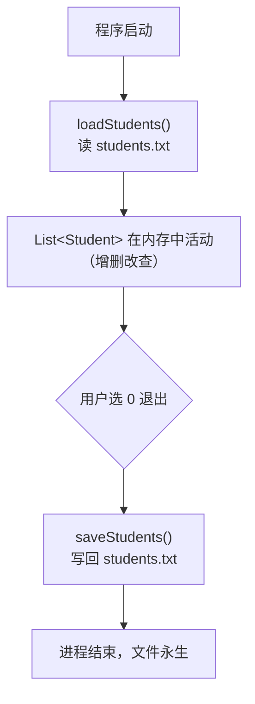

# Day 12 · 文件持久化

> 📅 阶段二：项目实战 ｜ ⏱ 建议用时：1.5~2 小时 ｜ 💻 从“一次性程序”进化为“有记忆的软件”

## 🎯 今日目标

1. 退出时把学生列表存入 `students.txt`
2. 启动时自动加载，数据「复活」
3. 亲手处理解析过程中的各种脏数据

## ⚡ 知识点速览

### 数据的一生



核心思路：**内存是工作台，文件是仓库**。开机从仓库上货，下班把工作台清回仓库。

> 💡 也可选「每次操作后立即保存」更安全（突然断电不丢数据），但写入频繁。本计划先做「退出保存」，留作你的思考题：两种策略各适合什么场景？

### 存储格式：一行一个学生（CSV）

```text
1001,小明,20,88.5
1002,小红,19,92.0
```

### 两个方法的责任清单

```java
// 保存：List<Student> → 文本
void saveStudents() {
    // for each 学生 → s.getId()+","+s.getName()+","+s.getAge()+","+s.getScore()
    // 一行 write + newLine；覆盖模式（不带 true）
}

// 加载：文本 → List<Student>
void loadStudents() {
    // while readLine 不为 null：
    //   split(",") 拆 4 段 → Integer.parseInt / Double.parseDouble
    //   new Student(...) → add 进列表
}
```

写和读是**互逆操作**：写入时拼了几个字段、按什么顺序，读出时就按同样规则拆 —— 格式是写给未来的自己（和程序）的合同。

### 加载的容错：脏数据不能拖垮启动

文件是用户可以打开乱改的！加载要考虑：

- **文件不存在**（首次运行）：`new FileReader(...)` 会抛 `FileNotFoundException` → catch 住，当作空列表启动，**不是错误**
- **某行格式坏掉**（少逗号、年龄是文字）：解析会抛 `NumberFormatException` / `ArrayIndexOutOfBoundsException` → 跳过这一行继续读后面的，并提示「第 N 行格式错误已跳过」

## 💻 跟着写

### 任务 1：saveStudents（约 25 分钟）

加到 `StudentService` 里（要访问 `students` 字段，写成它的方法最顺）：

```java
private static final String FILE_NAME = "students.txt";   // 常量：文件名只写一处

public void saveStudents() {
    try (BufferedWriter bw = new BufferedWriter(new FileWriter(FILE_NAME))) {
        // TODO: 遍历 students，每个学生拼一行写出
        System.out.println("已保存 " + students.size() + " 条数据");
    } catch (IOException e) {
        System.out.println("⚠️ 保存失败：" + e.getMessage());
    }
}
```

`Main` 的 `case "0"`：把「假装保存」换成 `service.saveStudents();` 再退出。

测试：添加 2 个学生 → 退出 → 用记事本打开项目根目录的 `students.txt` 检查内容。

### 任务 2：loadStudents（约 35 分钟）

```java
public void loadStudents() {
    try (BufferedReader br = new BufferedReader(new FileReader(FILE_NAME))) {
        String line;
        int lineNo = 0;
        while ((line = br.readLine()) != null) {
            lineNo++;
            // TODO: try { split → 解析 → new Student → add }
            //       catch (NumberFormatException | ArrayIndexOutOfBoundsException e)
            //       { 打印「第 lineNo 行格式错误，已跳过：」+ line }
        }
        System.out.println("启动完成，已加载 " + students.size() + " 条数据");
    } catch (FileNotFoundException e) {
        System.out.println("首次使用，从空数据开始");     // 文件不存在：正常
    } catch (IOException e) {
        System.out.println("⚠️ 读取失败：" + e.getMessage());
    }
}
```

> 💡 `catch (A | B e)` 一个 catch 接多种异常的写法，见过就会用。

`Main` 的 main 最开头（菜单循环之前）调用 `service.loadStudents();`。

### 任务 3：全流程验证 + 破坏性测试（约 20 分钟）

**正常流程**：
1. 启动（首次，提示空数据）→ 添加 3 个 → 退出
2. 再启动 → 查看全部 → 数据都在！🎉
3. 删 1 个 → 改 1 个 → 退出 → 再启动 → 确认改动持久了

**破坏性测试**（防御力检验，程序员必修）：
1. 用记事本把某行改成 `1001,小明,abc,88` → 启动 → 应提示该行跳过，其余正常
2. 手动删掉文件 → 启动 → 应提示首次使用
3. 在文件里追加一行空行 → 启动 → 不应崩（提示：`line.trim().isEmpty()` 的行直接跳过）

全部通过后：

```bash
git add . && git commit -m "day12: 文件持久化完成，数据重启不丢"
```

## 🧠 费曼时刻

**教学卡片**：

```markdown
## Day 12 教学卡片：持久化
- 用“工作台与仓库”讲讲内存和文件的分工
- save 和 load 为什么必须互逆？格式不一致会发生什么？
- 文件不存在为什么不算错误？哪些情况才算？
- 如果要给 Student 加一个字段（如电话），save/load 要改哪几处？（体会文本格式的维护成本）
- 我讲卡壳的地方：
```

## ✅ 自测清单

- [ ] 退出保存、启动加载都生效，重启后数据完整
- [ ] 文件不存在时正常启动
- [ ] 坏行会被跳过并提示，不拖垮程序
- [ ] 空行不会导致崩溃
- [ ] git 已提交
- [ ] 完成了今天的教学卡片

---
[⬅️ 上一天](day11-集合重构.md) ｜ [🏠 返回首页](/) ｜ [下一天：异常与体验优化 ➡️](day13-异常与体验优化.md)
