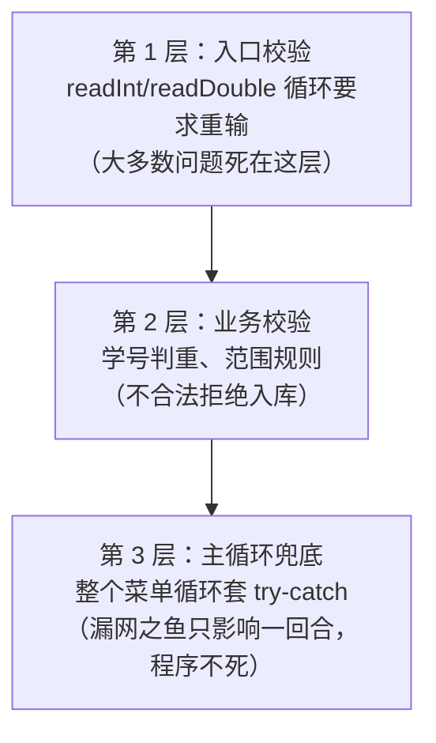

# Day 13 · 异常与体验优化

> 📅 阶段二：项目实战 ｜ ⏱ 建议用时：2 小时 ｜ 💻 让程序从“能用”变成“好用”，从“会崩”变成“打不死”

## 🎯 今日目标

1. 全面接管输入校验：非数字、越界、学号重复都拦住
2. 主循环整体兜底，任何异常都不让程序崩溃
3. 输出排版打磨，看起来像个正经软件

## ⚡ 知识点速览

### 防御式设计：不信任任何输入

到目前为止，`case "1"` 里 `sc.nextInt()` 遇到字母仍会崩。原则只有一条：

> **凡是用户敲的地方，都可能是错的；凡是数据到的地方，都可能是脏的。**

检查清单（今天全部落地）：

| 检查点 | 规则 | 手段 |
|---|---|---|
| 数字输入 | 必须是数字 | `readInt` / `readDouble`（Day 7 写的） |
| 年龄 | 10 ~ 120 | `readInt(sc, "年龄：", 10, 120)` |
| 成绩 | 0 ~ 100 | `readDouble` 带范围 |
| 学号 | 不重复、非负 | `findById` 判重 |
| 姓名 | 非空、长度合理 | `trim().isEmpty()` 检查 |

### 三层防线



前两层拦已知的错，第三层兜未知的错 —— 三层齐上，程序基本打不死。

### 排版：printf 对齐

表格输出用 `%-8s`（左对齐 8 格）这类宽度控制，中文名对齐效果因字宽略有出入，够用就好：

```java
System.out.println("----------------------------------------------");
System.out.printf("%-8s%-10s%-6s%-8s%n", "学号", "姓名", "年龄", "成绩");
System.out.println("----------------------------------------------");
for (Student s : students) {
    System.out.printf("%-8d%-10s%-6d%-8.1f%n",
            s.getId(), s.getName(), s.getAge(), s.getScore());
}
```

## 💻 跟着写

### 任务 1：搬入安全输入（约 20 分钟）

1. 把 Day 7 的 `InputHelper` 类复制进 `app` 包（改 package 声明）
2. 补一个姊妹方法 `readDouble`（同款逻辑，读小数）
3. `Main` 里所有 `sc.nextInt()` / `sc.nextDouble()` 全部替换成 `InputHelper.readInt(...)` / `readDouble(...)`

测试：每个数字输入处都喂 `abc`、负数、超范围值，看是否循环重问。

### 任务 2：业务校验收口（约 25 分钟）

1. **添加**：学号 `<= 0` 拒绝；重复学号拒绝（昨天已做，确认还在）
2. **姓名**：`name.trim().isEmpty()` 时提示重输（`while` + `sc.next()`）
3. **修改**：新成绩、新年龄也走范围校验（setter 里 Day 5 加的守门还在吗？双保险不冲突）

### 任务 3：主循环兜底（约 15 分钟）

给 `Main` 的菜单循环整体穿铠甲：

```java
while (true) {
    try {
        // 原有的：打印菜单、读选择、switch 分发
    } catch (Exception e) {
        System.out.println("⚠️ 操作出现问题：" + e.getMessage() + "，已返回主菜单");
        sc.next();   // 尽量吃掉可能残留的脏输入（nextLine 场景需自行调整）
    }
}
```

> 💡 `catch (Exception e)` 捕获所有异常，是兜底专用（正常逻辑不要这么粗暴，会掩盖问题）。可以顺手打印 `e` 看看是哪路神仙漏网了。

破坏性自测：整轮花式乱输入 2 分钟，目标 —— **程序活着回到主菜单**。

### 任务 4：体验打磨（约 30 分钟，量力选做）

按优先级从高到低：

1. `listAll` 换成 printf 表格对齐（上文代码）
2. 退出前确认：`确定退出吗？未保存将丢失 (y/n)`，`n` 回主菜单
3. 菜单加「7. 成绩统计」：人数、平均分、最高/最低分、各分数段人数（`if-else` 分段 + 计数，或 `Map<String, Integer>`）
4. 关键操作成功提示统一格式：`✅ 已添加学生 1001 小明`
5. 欢迎语显示当前学生人数：`当前共管理 5 名学生`

完成后：

```bash
git add . && git commit -m "day13: 输入校验+兜底+排版，体验优化完成"
```

## 🧠 费曼时刻

**教学卡片**：

```markdown
## Day 13 教学卡片：防御式编程
- 「三层防线」各拦什么错？各举一个例子
- catch (Exception e) 为什么只能当兜底，不能到处用？
- 用户输入有哪几类脏法？分别死在第几层？
- 今天哪个体验优化最提升“软件感”？
- 我讲卡壳的地方：
```

## ✅ 自测清单

- [ ] 所有数字输入处喂字母不再崩溃，会循环重问
- [ ] 年龄/成绩范围外会被拒
- [ ] 花式乱输入 2 分钟程序不死
- [ ] 表格输出对齐美观
- [ ] git 已提交
- [ ] 完成了今天的教学卡片

---
[⬅️ 上一天](day12-文件持久化.md) ｜ [🏠 返回首页](/) ｜ [下一天：复盘与进阶 ➡️](day14-复盘与进阶.md)
