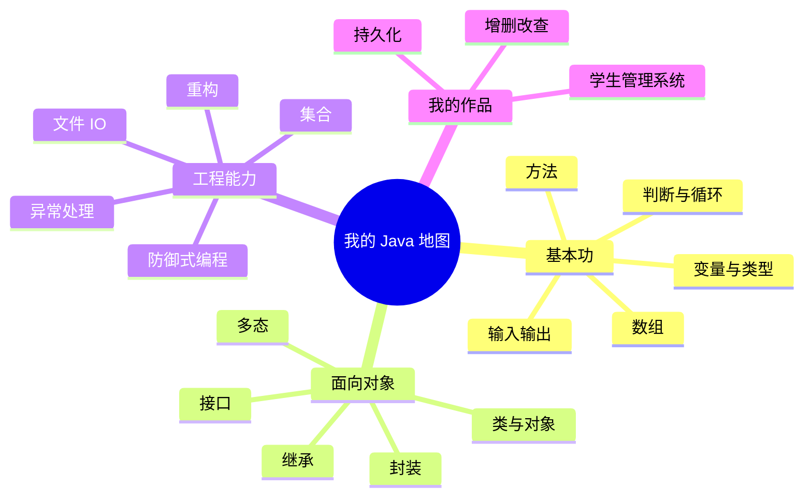
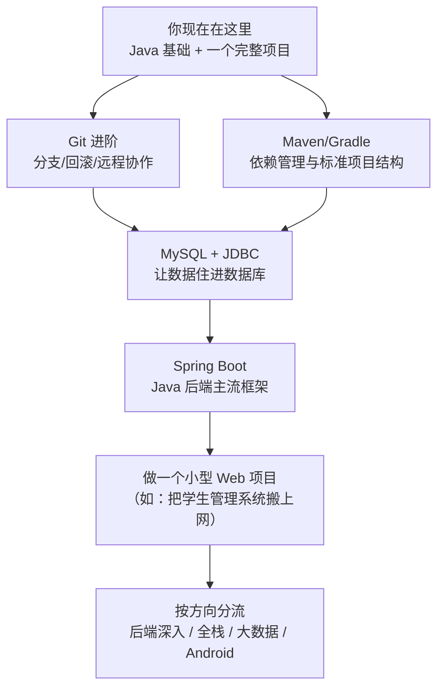

# Day 14 · 复盘与进阶

> 📅 阶段二：项目实战（收官） ｜ ⏱ 建议用时：2 小时 ｜ 🎓 今天不写新功能，做两件事：**回头看清自己走过的路**，**抬头看清前面的路**

## 🎯 今日目标

1. 完成费曼总输出：一篇「给小白的 Java 入门讲解」
2. 通过 20 问自测，定位薄弱点
3. 明确下一步学习路线

## 🧠 费曼总输出（今天最重要的任务，约 45 分钟）

把 14 天的内容**一次性讲清楚**。任选一种形式：

- 写一篇《给零基础小白的 Java 入门》，800~1500 字，配自己画的图
- 或者对着手机录一段 15~30 分钟的讲解视频（想象听众是完全不懂编程的朋友）
- 或者画一张覆盖全部知识点的思维导图，每个节点附一句大白话

**必须覆盖**（对着下面这张图讲）：

讲不出来的节点 = 漏洞，回对应的天数补课。这份输出也值得发给朋友或 AI（让 AI 扮演杠精小白追问你），被追问到哑口无言的地方，就是明天要复习的地方。

## ✅ 20 问自测（约 30 分钟）

闭卷作答，答不上来的标记出来：

**基础（Day 1–3）**
1. `int`、`double`、`boolean`、`String` 分别装什么？
2. `7 / 2` 和 `7.0 / 2` 的结果分别是多少？为什么？
3. `for` 和 `while` 各适合什么场景？
4. `break` 和 `continue` 的区别？
5. 方法的「参数」和「返回值」分别是什么？

**面向对象（Day 4–6）**
6. 类和对象的关系，用你自己的类比说一遍
7. 构造方法什么时候执行？和普通方法有什么区别？
8. 字段为什么要 `private`？外界怎么访问？
9. `super(...)` 必须写在子类构造的什么位置？为什么？
10. `@Override` 注解的作用？
11. `Person p = new Student(...)` 为什么合法？`p.introduce()` 执行的是谁的版本？
12. 接口和继承分别解决什么问题？
13. 比较两个字符串内容为什么必须用 `.equals()`？

**工程（Day 7–8，13）**
14. try-catch-finally 的执行顺序？
15. `ArrayList` 相比数组好在哪？
16. `HashMap` 适合什么场景？`getOrDefault` 的经典用法？
17. try-with-resources 省掉了什么？
18. 保存对象到文件，中间经历了哪两次转换？

**项目（Day 9–13）**
19. 「数组 + count」的删除为什么要前移元素？换成 `ArrayList` 后为什么不用了？
20. 你的系统有哪三层防线？各拦什么？

> 16 题以上轻松答对：非常优秀，可以放心进阶。10~15 题：正常，把标出的薄弱题回炉。10 题以下：把错题对应的天数重做一遍练习（通常 2~3 天即可），别急着往前跑。

## 💻 项目终检与回顾（约 20 分钟）

1. 从零运行完整演示：启动加载 → 添加 → 查看 → 模糊查询 → 修改 → 删除 → 统计 → 退出保存 → 重启验证
2. 打开 git log，从 day9 到 day13 重读自己的提交记录 —— **这就是你的开发成长史**
3. 留几个「如果再做一次」的思考（也是未来练手方向）：
   - 数据用数据库（MySQL）替代文件会怎样？
   - 要支持两个班级、多个字段，代码要动哪里？
   - 命令行换成本地窗口（Swing/JavaFX）或网页（Spring Boot），哪里能复用？

## 🗺️ 进阶路线

顺序建议：**Git 进阶与 Maven 可以穿插着来**（都是工具，用到就学）；数据库是下一步的重头；Spring Boot 之前最好再写 1~2 个控制台/桌面小项目巩固 OOP。

**资源推荐**（按需自取，不必贪多）：

- [Oracle 官方 Java 教程](https://dev.java/learn/)（权威，英文 OK 者首选）
- 廖雪峰 Java 教程（免费在线，中文，体系完整，适合查漏补缺）
- 《Head First Java》（讲解极其形象，适合零基础二刷巩固）
- IDEA 的 [官方入门视频](https://www.jetbrains.com/idea/guide/)（调试技巧值得专门学：断点、单步、查看变量 —— 早点用上，修 bug 效率翻倍）

## 🎓 结语

14 天前，你连 `javac` 是什么都不知道；现在，你有一个**数据能持久化、打不死、像模像样**的软件，和一份自己讲出来的知识地图。

更重要的是，你完整走过了一次真实软件的诞生：需求 → 骨架 → 功能 → 重构 → 加固 → 复盘。这个循环，将来做任何项目都一样。

**保持节奏：学一点，做一点，讲一点。** 下一站见。🚀

---
[⬅️ 上一天](day13-异常与体验优化.md) ｜ [🏠 返回首页](/)

---

**📝 给这套计划提反馈**：哪天卡住了、哪个讲法没看懂，把那篇文档改到你能懂 —— 修改文档本身就是最好的费曼练习。
