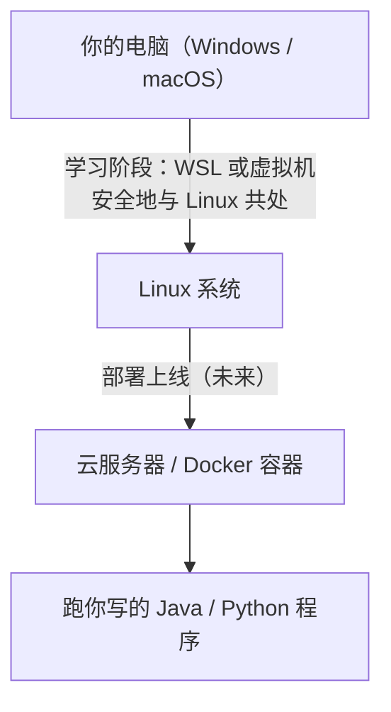

# 🐧 Linux 入门：与命令行做朋友

> ⏱ 建议用时：2 小时 ｜ 🎯 目标：会用命令行完成日常操作——文件遍历、查看内容、权限、进程管理，并在自己的电脑上跑通 Linux

## 这篇教程解决什么问题

你写的 Java / Python 程序，最终几乎都要跑在 **Linux 服务器**上（后端部署、云服务器、Docker 容器）。Linux 是服务器世界的语言，`命令行`是它的基本交互方式。

如果你只用 Windows，大概率这些操作靠鼠标和文件浏览器；**学会命令行，你就能用文字指挥一台机器**——而且这是程序员「摸服务器」的唯一方式。本教程不讲高深的系统管理，只讲每天写代码跑程序最常用的那批命令。



## 第 0 步：在自己电脑上跑 Linux（几种方式）

| 方式 | 难度 | 适合 |
|---|---|---|
| **WSL（Windows Subsystem for Linux）** | ⭐ 最省心 | Windows 用户首选：一条命令装好，开始菜单直接进命令行 |
| **虚拟机（VirtualBox + Ubuntu）** | ⭐⭐ | 想要完整图形界面体验 |
| **云服务器**（阿里云/腾讯云学生机） | ⭐⭐ | 顺便学部署，但要花钱/备案 |

**推荐 WSL**：Windows 10/11 自带，PowerShell 执行 `wsl --install` 装 Ubuntu，重启后从开始菜单打开 Ubuntu 即有完整命令行。装好后，下面所有练习都在这个终端里做。

## 核心观念：路径与命令

### 三个位置，先认路

| 符号 | 含义 | 类比 Windows |
|---|---|---|
| `/` | 根目录（一切从这开始） | `C:\` |
| `~` | 家目录（你的地盘） | `C:\Users\你` |
| `.` / `..` | 当前目录 / 上一级目录 | — |

> ⚠️ **最易踩的坑：Linux 用正斜杠 `/`，Windows 用反斜杠 `\`。** 目录分隔符写错，命令全失效。

### 认识这条命令的结构

```bash
ls -la /home/user     # 命令 | 选项(-la 小写，可合并) | 参数(要操作的对象)
```

## 必备命令速览：按用途分组

### ① 导航与查看（最常用，先背熟这组）

```bash
pwd                     # 我在哪（Print Working Directory）
ls                      # 列出当前目录内容
ls -l                   # 详细信息（权限、大小、时间）
ls -a                   # 含隐藏文件（文件名以 . 开头）
cd 目录                 # 进入目录（cd .. 回上一级，cd 回主目录）
```

### ② 文件操作

```bash
touch a.txt             # 新建空文件
mkdir folder            # 新建目录
cp a.txt b.txt          # 复制
mv a.txt b.txt          # 移动（也是重命名：mv old.txt new.txt）
rm a.txt                # 删除（⚠️ 无回收站！）
rm -r folder            # 递归删目录
less a.txt              # 查看大文件内容（按 q 退出）
head -5 a.txt           # 看前 5 行
tail -f app.log         # 实时看日志（摸服务器时极其常用，Ctrl+C 退出）
```

### ③ 查找内容

```bash
grep "error" app.log        # 在文件里找含 error 的行（类似用 Ctrl+F）
grep -rn "TODO" src/        # -r 递归目录、-n 显示行号
find . -name "*.java"       # 找文件名叫 .java 的所有文件
```

### ④ 权限与用户

```bash
ls -l 一个文件    # 看权限，长这样：-rw-r--r--
chmod +x run.sh   # 给脚本加可执行权限
sudo command      # 用管理员（root）身份执行
```

`rw-r--r--` 三组读法：**第一组属主、第二组同组、第三组其他人**；`r`读 `w`写 `x`执行。`chmod` 先记 `+x`（加执行）就够日常用。

### ⑤ 进程与系统

```bash
ps aux               # 查看所有进程
top / htop           # 实时系统监控（内存/CPU）
kill PID             # 结束某个进程（PID 用 ps 查到）
Ctrl+C               # 中断当前正在跑的程序
```

## 💻 动手练习：命令行冒险（约 40 分钟）

在 WSL/终端里，按步骤走一遍，每步都动手敲：

```bash
# Step 1. 认识自己的家
pwd                # 应该是 /home/你的用户名
mkdir practice     # 建个练习目录
cd practice        # 进去

# Step 2. 建文件、写内容
touch hello.txt
echo "hello linux" > hello.txt      # > 把输出写进文件（记事本 CLI 版）
echo "second line" >> hello.txt     # >> 追加
cat hello.txt                        # 查看

# Step 3. 复制、改名、删除
cp hello.txt hello_copy.txt
mv hello.txt greeting.txt
rm hello_copy.txt
ls           # 现在只剩 greeting.txt

# Step 4. 搜索
mkdir src && cd src && touch Main.java
echo "public class Main {}" > Main.java
cd ..
grep -rn "public" src/     # 能找到 src/Main.java 里的 public

# Step 5. 权限
chmod +x greeting.txt      # 虽不是脚本，但感受下 chmod 的用法
```

<details>
<summary>💡 卡住了？参考解答</summary>

- `ehco` 写错命令？→ 提示 `command not found`，改用 `echo`（少个 o）
- `cd` 进不去？→ 检查目录名拼写，`pwd` + `ls` 确认当前在哪
- `grep` 没结果？→ 确认 `&&` 串接时路径没写错，多试几个关键词
</details>

完成后再做一道「清理题」：把 `practice` 目录连文件一起删掉（提示：`rm -r`）。

## 🧼 养成好习惯：三条纪律

1. **`rm` 没有回收站**——危险操作（尤其带 `-r`）前，先 `ls` 确认目标
2. **新手别玩 `sudo rm -rf /`**——这是删光全系统的自杀命令，看到别好奇
3. **用 `Ctrl+C` 终止**——别用关窗口的方式结束运行中的程序

## ❓ 常见问题

| 现象 | 原因与解法 |
|---|---|
| `command not found` | 命令拼错或没装：确认拼写，或 `which 命令名` 看它装在哪 |
| 权限不够 `Permission denied` | 加 `sudo`，或对文件 `chmod +x` / 用 `chown` 改属主 |
| 进 WSL 没图形界面 | 正常，WSL 是纯命令行；想用图形界面装虚拟机版 |
| 中文乱码 | 终端编码问题：多数情况 `export LANG=C.UTF-8` 可解 |
| `kill` 没反应 | 先 `kill -9 PID`（强制杀），再不行确认 PID 是否正确 |
| 忘了在哪个目录 | `pwd` 看位置，`cd` 键直接回主目录 |

## 🧠 费曼时刻

**教学卡片**：

```markdown
## Linux 入门教学卡片
- Linux 的 `/` 和 Windows 的 `\` 有什么区别？`/home` 是什么？
- `ls` `cd` `pwd` 三个命令各回答什么问题？（我在哪？有什么？去哪？）
- `grep` 是干嘛的？类比 Windows 的哪个操作？
- `>` 和 `>>` 的区别？各什么时候用？
- 为什么说「rm 没有回收站」？这决定了什么使用习惯？
- 我讲卡壳的地方：
```

## ✅ 自测清单

- [ ] 能默写 `pwd` / `ls` / `cd` / `ls -l` 的含义
- [ ] 会用 `>` 重定向把内容写进文件
- [ ] 会用 `grep -rn` 在目录里搜关键词
- [ ] 知道 `/` 和 `~` 分别代表什么
- [ ] 完成练习，成功建、查、删文件，并把 `practice` 目录清理掉
- [ ] 能说出 `chmod +x` 是干嘛的
- [ ] 完成了今天的教学卡片

## 🔗 下一步

- 部署篇：学完本教程就能开始接触 [Docker](https://www.docker.com/)（用容器把你的 Java 应用打包运行）——部署的第一步
- 脚本化：给重复性操作写 shell 脚本（`.sh` 文件 + `chmod +x`）
- 搭配使用：跑服务器时配合 [Git](/git/README.md) 和 [MySQL](/mysql/README.md) 的远程操作，三者是后端的黄金组合
