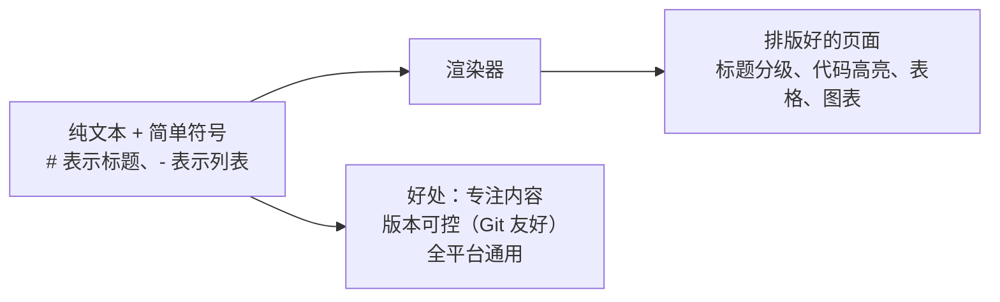
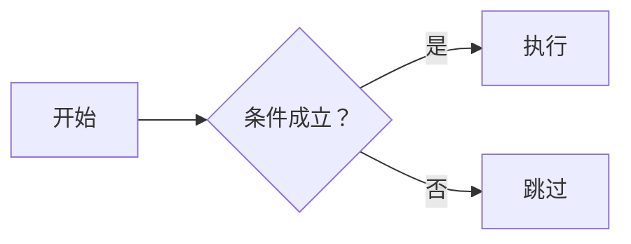

# ✍️ Markdown 入门：写作即排版

> ⏱ 建议用时：1 小时 ｜ 🎯 目标：掌握日常写作的全部常用语法，独立写出一页排版规范的个人 README

## 这篇教程解决什么问题

Markdown 是程序员的**通用写作格式**：用几个简单符号标记标题、列表、代码，写出来是纯文本，渲染出来就是排版好的页面。GitHub 的 README、技术博客、语雀 / Notion / Obsidian 笔记、AI 对话的回复，底层全是它。

你其实早就在用它了——

- **本站所有文档**都是 Markdown 写的（侧边栏的每个链接对应一个 `.md` 文件）
- Java 计划里每天的 **🧠 费曼教学卡片**，模板就是为 Markdown 设计的
- 学完这篇，你就可以**直接给本站贡献文档**（见仓库 README 的贡献指引）



## 第 0 步：选一个编辑器

| 工具 | 特点 | 适合 |
|---|---|---|
| **VS Code** | 已内置支持：`Ctrl + Shift + V` 打开预览，`Ctrl + K V` 左右分屏对照 | 装了 VS Code 就零成本 |
| **Typora** | 所见即所得，敲符号立刻变排版 | 想要 Word 般体验 |
| **GitHub / Gitee 网页** | 在线新建 `.md` 文件，编辑时旁边就是预览 | 不想装任何东西 |
| **Obsidian** | 本地知识库 + 双向链接 | 长期记笔记（费曼卡片仓库） |

下面的练习建议用 **VS Code 分屏模式**：左边敲源码、右边实时看渲染效果，学得最快。

## 核心语法速览

### 标题：# 的数量 = 级别

```markdown
# 一级标题（页面大标题，一篇只用一次）
## 二级标题（章节）
### 三级标题（小节）
```

> ⚠️ `#` 和文字之间**必须有一个空格**，否则很多渲染器不认。

### 行内标记：强调与代码

| 你写 | 你看到 |
|---|---|
| `**粗体**` | **粗体** |
| `*斜体*` | *斜体* |
| `~~删除线~~` | ~~删除线~~ |
| `` `行内代码` `` | `行内代码` |
| `[链接文字](https://example.com)` | [链接文字](https://example.com) |
| `` | 显示一张图片 |

### 列表：减号和数字

```markdown
- 无序列表项（- 或 * 开头）
- 另一项
  - 缩进两/四空格变成子项

1. 有序列表
2. 第二项
3. 第三项

- [ ] 任务清单：未完成
- [x] 任务清单：已完成
```

渲染效果：

- 无序列表项（`-` 或 `*` 开头）
- 另一项
  - 缩进两/四空格变成子项

1. 有序列表
2. 第二项
3. 第三项

- [ ] 任务清单：未完成
- [x] 任务清单：已完成（本站首页的「学习进度打卡」就是这么写的）

### 代码块：三个反引号

````markdown
```java
public class Hello {
    public static void main(String[] args) {
        System.out.println("Hello!");
    }
}
```
````

效果（语言名换成 `python`、`bash` 等还能获得对应高亮）：

```java
public class Hello {
    public static void main(String[] args) {
        System.out.println("Hello!");
    }
}
```

### 引用、分割线、表格

```markdown
> 引用一段话：两个大于号也行，嵌套引用用 >>
```

> 引用一段话：本站每篇教程开头的「建议用时」就是引用块。

```markdown
---
```

（三个减号 = 分割线，本站用它分隔每天的内容板块）

表格用竖线和横线拼（第二行的 `---` 是表头分隔，冒号控制对齐）：

```markdown
| 左对齐 | 居中 | 右对齐 |
| :----- | :--: | -----: |
| a      | b    | c      |
```

| 左对齐 | 居中 | 右对齐 |
| :----- | :--: | -----: |
| a      | b    | c      |

## 进阶两招（本站特色）

### 招式一：mermaid 图表

在代码块标记语言为 `mermaid`，就能画流程图、类图、思维导图——本站所有图表都是这么画的：

````markdown

````

效果：


> 💡 节点文字含括号、逗号等特殊字符时记得加引号，语法细节见仓库 `AGENTS.md` 的约束。

### 招式二：折叠块

把答案或提示折叠起来，点开才看——本站猜数字练习的「提示」就是它：

````markdown
<details>
<summary>💡 点我看提示</summary>

这里是被折叠的内容（和 summary 之间空一行，Markdown 才会渲染）。
</details>
````

效果：

<details>
<summary>💡 点我看提示</summary>

这就是折叠块的样子。写练习题答案、避免剧透非常好用。
</details>

## 💻 动手练习

### 练习 1：把费曼卡片写成 Markdown（跟打，约 15 分钟）

新建 `my-notes.md`，把 [Day 0 的教学卡片](/java/day00-环境搭建.md)用 Markdown 排版出来——要求用到：二级标题、任务列表、行内代码、一个代码块（贴你 Day 0 的命令行记录）。

### 练习 2：写一份自我介绍 README（核心练习，约 25 分钟）

新建 `README.md`，内容关于你自己，**必须用到全部 8 个元素**：

1. 一级标题 + 一句引用块简介
2. 二级标题分节（如「技能」「正在学习」「目标」）
3. 一张表格（如：语言 / 掌握程度 / 计划）
4. 一个任务清单（学习进度）
5. 一段行内代码和一个小代码块
6. 一个链接（链到本站任意教程）
7. 一条分割线
8. （选做）一个 mermaid 小图，画出你的学习路线

### 练习 3：排版改造（独立，约 15 分钟）

把下面这段「纯文字烂排版」改成规范的 Markdown（自己动手，别看本站的写法）：

> 学习计划第一天学了变量和类型。重点有四个类型：int 整数、double 小数、boolean 布尔、String 字符串。注意 7/2=3 是整数除法，想要 3.5 要写成 7.0/2。练习做了 BMI 计算器：输入身高体重，公式是 bmi = weight / height / height，输出保留一位小数。

要求：类型用表格、公式用代码块、注意事项用引用块、BMI 步骤用有序列表。

## ❓ 常见问题

| 现象 | 原因与解法 |
|---|---|
| 换行不生效 | Markdown 里单个回车不算换行：段末加两个空格，或空一行开新段落 |
| `#标题` 没变成标题 | `#` 后少了个空格 |
| 表格没渲染 | 表头下少了 `---` 分隔行，或每列竖线数量不齐 |
| 图片不显示 | 检查路径：相对路径是相对 `.md` 文件所在目录；本站图片放 `docs/images/` |
| 特殊符号（如 `*`）想原样显示 | 前面加反斜杠转义：`\*` |
| 嵌套列表全排成一列 | 子项缩进不够：缩进 2~4 个空格，和父项符号对齐 |

## 🧠 费曼时刻

**教学卡片**：

```markdown
## Markdown 入门教学卡片
- 用自己的话讲：Markdown 和 Word 的本质区别是什么？（内容与排版分离？）
- 「纯文本 + 版本可控」为什么对程序员重要？（提示：Git diff）
- 表格、代码块、任务清单的语法各是什么？默写一遍
- 我讲卡壳的地方：
```

## ✅ 自测清单

- [ ] 能不看资料默写：标题、粗体、行内代码、无序列表、链接的语法
- [ ] 知道代码块标语言名能获得语法高亮
- [ ] 会用 VS Code 的分屏预览边写边看
- [ ] 练习 2 的自我介绍 README 用齐了 8 个元素
- [ ] 知道换行不生效时该怎么办
- [ ] 完成了今天的教学卡片

## 🔗 下一步

- 用 Markdown + Git 管理你的费曼卡片：配合 [Git 入门](/git/README.md)把 `my-notes.md` 提交进仓库
- 写给自己看 → 写给别人看：试着按仓库 README 的贡献指引，给本站改进一篇文档（改到你自己能懂，就是最好的费曼练习）
- 工具进阶：Obsidian（笔记库）、Marp（用 Markdown 做 PPT）
