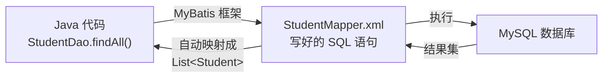
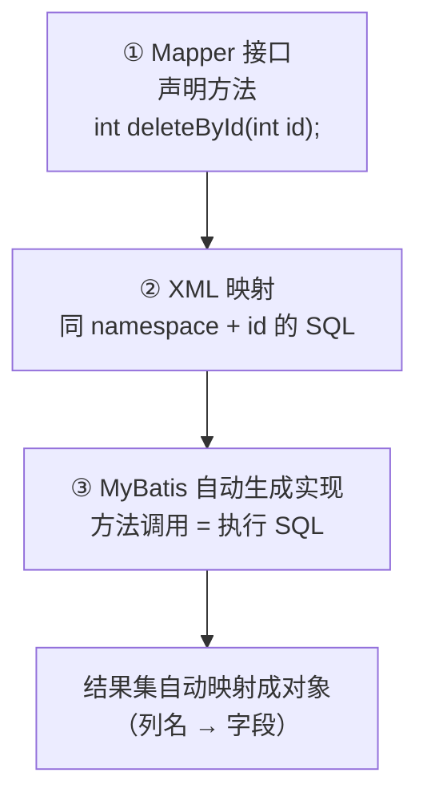

# 📝 MyBatis 入门：让 Java 和 SQL 不再各自为战

> ⏱ 建议用时：2 小时 ｜ 🎯 目标：理解为什么需要 MyBatis，会用 Mapper 接口和 XML 完成 CRUD，并能把 MySQL 教程里的 JDBC 代码升级成 MyBatis

## 这篇教程解决什么问题

你已经会用 **JDBC**（[MySQL 教程](/mysql/README.md)）操作数据库了。但 JDBC 有个明显痛点：**SQL 和 Java 代码混在一起、还要自己管理连接和结果映射**——写一个查询，既要手写 SQL 字符串（还容易拼错），又要 `ResultSet` 一行行 `getXxx` 取值，代码冗长容易出错。

**MyBatis** 是关于 Java 持久层的流行框架（在国内尤其主流），它是「Java 对象 ↔ 数据库记录」之间的桥梁，让你把 **SQL 写在独立的 XML 配置文件里、Java 里只调方法**，职责分离、写起来清爽。它是你 [Day 14 进阶路线](/java/day14-复盘与进阶.md)（MySQL + JDBC → MyBatis/Spring Boot）上「JDBC 的接班人」。



## 第 0 步：环境搭建（用 Maven 项目）

MyBatis 需要引入依赖 + 一个配置文件。它常配着 **Maven** 用（也是 [Day 14](/java/day14-复盘与进阶.md) 提到的学习项，先会基础即可）：

```xml
<!-- pom.xml -->
<dependencies>
  <!-- MyBatis 核心 -->
  <dependency>
    <groupId>org.mybatis</groupId>
    <artifactId>mybatis</artifactId>
    <version>3.5.16</version>
  </dependency>
  <!-- MySQL 驱动（复用 MySQL 教程的） -->
  <dependency>
    <groupId>mysql</groupId>
    <artifactId>mysql-connector-j</artifactId>
    <version>8.4.0</version>
  </dependency>
</dependencies>
```

和一个核心配置 `mybatis-config.xml`，主要是两项：**① 连数据库的信息、② 告诉它去哪找 SQL**。下面演示用最简单的纯 MyBatis 方式；等项目用上 Spring Boot，MyBatis 会进一步被自动装配，更省心。

### 一个核心配置文件（mybatis-config.xml）

```xml
<?xml version="1.0" encoding="UTF-8" ?>
<!DOCTYPE configuration
  PUBLIC "-//mybatis.org//DTD Config 3.0//EN"
  "http://mybatis.org/dtd/mybatis-3-config.dtd">
<configuration>
  <environments default="dev">
    <environment id="dev">
      <transactionManager type="JDBC"/>
      <dataSource type="POOLED">
        <property name="driver" value="com.mysql.cj.jdbc.Driver"/>
        <property name="url" value="jdbc:mysql://localhost:3306/student_db?useSSL=false&serverTimezone=UTC"/>
        <property name="username" value="root"/>
        <property name="password" value="你的密码"/>
      </dataSource>
    </environment>
  </environments>
  <mappers>
    <mapper resource="mapper/StudentMapper.xml"/>   <!-- 告诉它去哪找 SQL -->
  </mappers>
</configuration>
```

## 核心三步：方法接口 + SQL 映射 + 自动映射结果

MyBatis 的核心机制就三步，缺一不可（记死这个流程）：



### 第一步：Mapper 接口（只声明方法，不写实现）

```java
package com.example.student;

import java.util.List;

public interface StudentMapper {
    Student findById(int id);              // ① 方法
    List<Student> findAll();               // ② 列表
    void insert(Student s);                // ③ 新增
    void update(Student s);                // ④ 改
    void deleteById(int id);               // ⑤ 删
}
```

### 第二步：XML 里写对应 SQL（同一命名空间 + 方法名）

```xml
<?xml version="1.0" encoding="UTF-8" ?>
<!DOCTYPE mapper
  PUBLIC "-//mybatis.org//DTD Mapper 3.0//EN"
  "http://mybatis.org/dtd/mybatis-3-mapper.dtd">
<mapper namespace="com.example.student.StudentMapper">   <!-- 绑定到接口 -->

  <select id="findById" resultType="com.example.student.Student">
    SELECT id, name, age, score FROM students WHERE id = #{id}
  </select>

  <select id="findAll" resultType="com.example.student.Student">
    SELECT id, name, age, score FROM students
  </select>

  <insert id="insert">
    INSERT INTO students (id, name, age, score) VALUES (#{id}, #{name}, #{age}, #{score})
  </insert>

  <update id="update">
    UPDATE students SET name=#{name}, age=#{age}, score=#{score} WHERE id=#{id}
  </update>

  <delete id="deleteById">
    DELETE FROM students WHERE id = #{id}
  </delete>
</mapper>
```

> 💡 **`#{参数}`** 是 MyBatis 的神兵利器：它用**占位符预编译**，自动帮你处理转义和类型转换，天然**防 SQL 注入**（对比 JDBC 里手动拼字符串，安全又省心）。`resultType` 指定「查出来映射成哪个类」——MyBatis 会用列名自动填字段。

### 第三步：写实现类，用 SqlSession 跑起来

```java
package com.example.student;

import org.apache.ibatis.session.SqlSession;
import org.apache.ibatis.session.SqlSessionFactory;
import org.apache.ibatis.session.SqlSessionFactoryBuilder;
import java.io.InputStream;
import java.util.List;

public class StudentDao {
    // 工具方法：从配置文件创建 SqlSessionFactory
    private static SqlSessionFactory buildFactory() {
        try (InputStream in = org.apache.ibatis.io.Resources.getResourceAsStream("mybatis-config.xml")) {
            return new SqlSessionFactoryBuilder().build(in);
        } catch (Exception e) {
            throw new RuntimeException("加载配置失败", e);
        }
    }

    public List<Student> findAll() {
        try (SqlSession session = buildFactory().openSession()) {
            return session.getMapper(StudentMapper.class).findAll();   // 调用接口方法
        }
    }
    // deleteById / insert / update 同理：mapper.xxx() 后记得 session.commit()
}
```

**要点**：`session.getMapper(StudentMapper.class)` 让 MyBatis 帮你生成接口的实现（这就是「接口只声明、实现自动来」）。MySQL 教程里那些手动 `Connection`/`PreparedStatement`/`ResultSet` 的样板代码，**到这里全部消失**。

## 💻 动手练习

### 练习 1：跑通第一个 MyBatis 查询（跟打，约 30 分钟）

建 Maven 项目，按上面的三部分代码搭好，执行 `findAll()` 打印出学生列表。

卡点排查：
- `Resources.getResourceAsStream` 找不到文件？→ 确认 `mybatis-config.xml` 放在 `src/main/resources/` 下
- XML 报 `BindingException`？→ `namespace` 和接口**全限定名**一致、`id` 和方法名一致、参数类型匹配
- 中文乱码？→ 建表用 `utf8mb4`，连接串加 `characterEncoding=utf8`

### 练习 2：写一条条件查询（半独立，约 15 分钟）

给 `StudentMapper` 加方法 `List<Student> findByScore(double min)`，返回成绩 ≥ min 的学生。需要在 XML 里加一个带 `WHERE score >= #{min}` 的 `<select>`。思路完全复刻 MySQL 教程里的 `WHERE` 语法——现在它只是把你熟悉的一句 SQL 放进了一个更优雅的载体。

### 练习 3（选做）：做一个简单动态查询（约 20 分钟）

用 `<if>` 标签实现「按名称模糊查询，若传了年龄段再叠加筛选」：

```xml
<select id="search" resultType="com.example.student.Student">
  SELECT * FROM students
  <where>
    <if test="name != null"> AND name LIKE CONCAT('%', #{name}, '%') </if>
    <if test="minAge != null"> AND age >= #{minAge} </if>
  </where>
</select>
```

> 这就是 MyBatis 的**动态 SQL**——根据传入条件拼凑 WHERE。它是 MyBatis 区别于 JDBC 的强大之处：不用在 Java 里写一堆 `if` 拼字符串了。

## ❓ 常见问题

| 现象 | 原因与解法 |
|---|---|
| `BindingException: Invalid bound statement` | namespace 或 id 对不上接口：检查 XML 的 namespace 全限定名、方法名一致性 |
| 插入没生效 | MyBatis 默认手动提交：`session.commit()` 别漏 |
| 映射 `getXxx`，字段全是 null | 列名和字段名不一致：SQL 里给列起别名 `SELECT score AS s`，或用 `<resultMap>` 显式映射 |
| 找不到 `.xml` 文件 | 放错位置：必须在 `src/main/resources/` 且 `mybatis-config.xml` 里路径正确 |
| `#{}` 里写错变量名 | 参数名和接口方法参数或对象属性一致（`#{name}` 对应 `getName()`） |
| 不知道用 MyBatis 还是 Spring Data JPA | 国内企业更常用 MyBatis（SQL 可控）；JPA 也可以，本教程先掌握一个 |

## 🧠 费曼时刻

**教学卡片**：

```markdown
## MyBatis 入门教学卡片
- JDBC 写 CRUD 有哪些不变的法？MyBatis 帮我们剔除了哪几类？
- 用「菜单点菜 / 后厨执行」类比讲：Mapper 接口、XML、MyBatis 框架三者关系
- `#{score}` 是什么？为什么要用参数占位（防注入）？
- resultType 做什么？「自动映射」是什么意思？
- 动态 SQL（<if>）解决了 JDBC 的什么痛点？
- 我讲卡壳的地方：
```

## ✅ 自测清单

- [ ] 能说清 MyBatis 相比 JDBC 的两点改进
- [ ] Mapper 接口 + XML 的 namespace / id 如何对应，能默写
- [ ] 会写一个 `#{参数}` 的查询和插入
- [ ] `SqlSession` 打开后为什么能拿到接口实现（`getMapper`）
- [ ] 理解「列名 → 字段名」的自动映射及其失效场景
- [ ] MyBatis 查询跑通，练习 2 的条件查询完成
- [ ] 完成了今天的教学卡片

## 🔗 下一步

- **组合**：配上 [Spring Boot](/java/day14-复盘与进阶.md)，MyBatis 会更加自动（注解式 Mapper、自动扫描接口），形成现在 Java 后端的标准组合 **Spring Boot + MyBatis + MySQL**
- **量级**：数据量大时了解「分页插件」（MyBatis-Plus、PageHelper），它让 SQL 更省心
- **深入**：`<resultMap>` 处理多表关联（JOIN 的 MyBatis 版）；`#{}` 与 `${}` 的实质区别（防止注入的最佳实践）
- **配合**：持久层之后，用 [HTTP/REST](/http/README.md) 把这些查询暴露成 Web 接口
