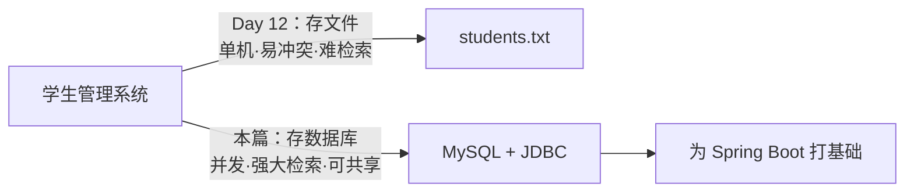
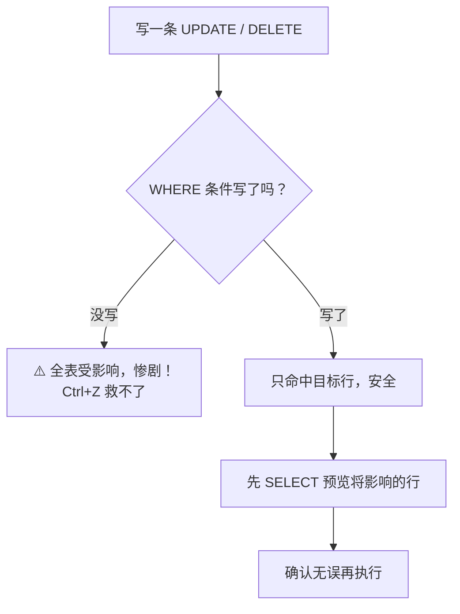
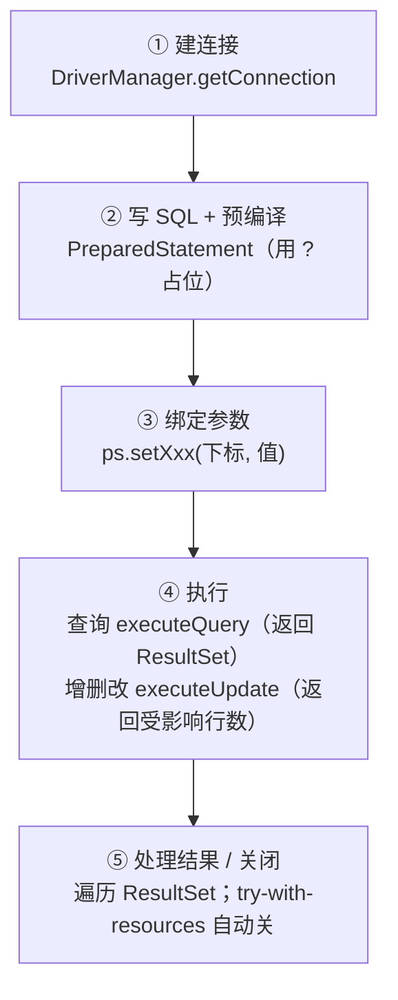

# 🗄️ MySQL 入门：从 SQL 到 JDBC

> ⏱ 建议用时：2.5 小时 ｜ 🎯 目标：会用 SQL 建表/增删改查，会用 JDBC 在 Java 里操作数据库，把学生管理系统的数据从文件搬进 MySQL

## 这篇教程解决什么问题

[Java 入门计划](/java/day00-环境搭建.md)里，你的学生管理系统用数据**存进了文件**（Day 12）。文件适合单机小量，但也有痛点：多个程序同时读写会冲突、数据一多又慢又难查、没法多人共享。

**数据库**就是来解决这些问题的：一个专业的、能并发、能检索、能持久化的数据仓库。本教程选用 **MySQL**（最主流的开源关系型数据库），并带你用它升级学生管理系统——这正好是 Java 进阶路线（MySQL + JDBC → Spring Boot）的第一站。



## 第 0 步：安装与连接

1. **装 MySQL**：下载 [MySQL Community Server](https://dev.mysql.com/downloads/mysql/) 或 [XAMPP](https://www.apachefriends.org/)（自带 MySQL + 图形界面，新手更省心），安装时记好 root 密码
2. **验证**：命令行输入 `mysql -uroot -p` 输入密码，看到 `mysql>` 提示符即成功
3. **必备工具**：装一个 GUI（[Navicat](https://www.navicat.com/)、[DBeaver](https://dbeaver.io/)、或 Workbench）——新手强烈建议，能直观看到表和数据，比纯命令行友好得多

概念先行，就四个词：

| 名词 | 类比（学生管理系统） | 例子 |
|---|---|---|
| 数据库 database | 一本书 | `student_db` |
| 表 table | 书里的一页表格 | `students` 表 |
| 行 row / 记录 | 表格里的一行 = 一个学生 | `1001 小明 20 88.5` |
| 列 column / 字段 | 表头的一列 = 一种属性 | `id`、`name`、`score` |

## SQL 基础：数据操作四件套

SQL 是操作数据库的语言，90% 的日常就是下面四条（增删改查）。

### 建库 + 建表（一次性的准备工作）

```sql
CREATE DATABASE IF NOT EXISTS student_db;          -- 建库
USE student_db;                                     -- 切换到该库

CREATE TABLE IF NOT EXISTS students (               -- 建表：定义每一列类型
    id INT PRIMARY KEY,                             -- 主键：唯一标识，不重复
    name VARCHAR(20) NOT NULL,                      -- 定长/变长文本
    age INT,
    score DECIMAL(4,1)                              -- DECIMAL(4,1)：共4位、1位小数
);
```

> 💡 `PRIMARY KEY`（主键）尤其重要：它保证每行能被唯一找到，就像学号——不能重复、不能为空。这张表的结构，正是 [Day 4](/java/day04-类与对象.md) 定义的 Java 版 `Student` 类（字段：id/name/age/score）。

### 增删改查（CRUD）

```sql
-- 增：Insert
INSERT INTO students (id, name, age, score) VALUES (1001, '小明', 20, 88.5);
INSERT INTO students (id, name, age, score) VALUES (1002, '小红', 19, 92.0);

-- 查：Select（本篇的重头，最灵活）
SELECT * FROM students;                            -- 全表
SELECT name, score FROM students;                  -- 只选某几列
SELECT * FROM students WHERE score >= 90;          -- 条件过滤
SELECT * FROM students ORDER BY score DESC;        -- 排序（DESC 降序）
SELECT COUNT(*) FROM students;                     -- 统计行数
SELECT AVG(score) FROM students;                   -- 平均值

-- 改：Update
UPDATE students SET score = 91.0 WHERE id = 1002;

-- 删：Delete
DELETE FROM students WHERE id = 1001;
```

**写 SQL 的黄金口诀：`UPDATE` 和 `DELETE` 前，先 `SELECT ... WHERE` 想好条件，绝不能不写 WHERE——否则整表被改/清空。**



### 条件运算符：和 Java 很像

```sql
WHERE age >= 18 AND score < 60          -- AND / OR / NOT，同 Java 逻辑
WHERE name LIKE '小%'                    -- 模糊查询：% 是通配符（相当于 Java 的 contains）
WHERE age BETWEEN 18 AND 22             -- 区间
WHERE id IN (1001, 1003)                -- 集合
```

## 💻 动手练习：用 SQL 管理学生

在 GUI 或命令行里完成（约 25 分钟）：

1. 建库 `student_db`、建表 `students`（照上面的建表语句）
2. 插入 5 个学生（自己编数据：id、name、age、score）
3. 查询：成绩 >= 80 的学生；按成绩从高到低排序；姓「王」的学生
4. 把某个学生成绩改成 95；删除一个学生
5. 统计：全班平均分、最高分、人数

做完这条，你把 [Day 10 增删改查](/java/day10-增删改查.md) 的逻辑在 SQL 里又实现了一遍——同一件事，两种语言。

## 进阶一步：多表关联（理解即可，会用 JOIN）

真实系统是多张表关联的（学生表 + 班级表）。`JOIN` 把多张表按某个字段拼起来：

```sql
-- 学生表带班级ID，查询时连出班级名
SELECT s.name, s.score, c.name AS class_name
FROM students s
JOIN classes c ON s.class_id = c.id;
```

先用文字理解：**JOIN 就是「把两张表按共同字段粘成一张大表再查」**。会这个词、见过语法就行，写项目时现查。

## JDBC：在 Java 里操作数据库

SQL 是在数据库 GUI 里敲，但你的程序怎么读写它？**JDBC**（Java Database Connectivity）就是 Java 连数据库的标准 API。配套 Maven 依赖：

```xml
<!-- pom.xml 里加这个（Maven 会自动下载驱动） -->
<dependency>
    <groupId>mysql</groupId>
    <artifactId>mysql-connector-j</artifactId>
    <version>8.4.0</version>
</dependency>
```

### 连接 + 查询

```java
// 1. 加载并建立连接（try-with-resources 自动关闭，day08 学的）
try (Connection conn = DriverManager.getConnection(
        "jdbc:mysql://localhost:3306/student_db?useSSL=false&serverTimezone=UTC",
        "root", "你的密码");
     PreparedStatement ps = conn.prepareStatement(
        "SELECT * FROM students WHERE score >= ?");
     ) {
    // 2. 用 ? 占位符传参数（比拼接字符串安全，防 SQL 注入）
    ps.setDouble(1, 80);
    // 3. 执行查询，历游结果
    try (ResultSet rs = ps.executeQuery()) {
        while (rs.next()) {
            System.out.printf("%d %s %d %.1f%n",
                rs.getInt("id"), rs.getString("name"),
                rs.getInt("age"), rs.getDouble("score"));
        }
    }
} catch (SQLException e) {
    System.out.println("数据库出错：" + e.getMessage());
}
```

### JDBC 五步走（背下这个套路）



对比你熟悉的流程：`Connection` 像打开文件、`PreparedStatement` 像 `BufferedWriter`、`ResultSet` 像逐行读取——就是 [Day 8 文件 IO](/java/day08-文件IO与泛型速览.md) 的数据库版。

### 增删改用 executeUpdate

```java
// 插入一条
String sql = "INSERT INTO students (id, name, age, score) VALUES (?, ?, ?, ?)";
try (Connection conn = ...; PreparedStatement ps = conn.prepareStatement(sql)) {
    ps.setInt(1, 1003);
    ps.setString(2, "小刚");
    ps.setInt(3, 21);
    ps.setDouble(4, 76.5);
    int rows = ps.executeUpdate();       // 返回受影响行数
    System.out.println("插入成功，" + rows + " 行受影响");
}
```

## 💻 综合练习：升级学生管理系统（约 40 分钟）

把你 [Day 12 文件持久化](/java/day12-文件持久化.md) 的学生管理系统，从存文件改造成存数据库：

1. 加 Maven 依赖（上面的 pom.xml）和 MySQL 驱动
2. 写 `StudentDao` 类，方法：`insert`、`findAll`、`deleteById`、`updateById`——每个方法就是上面 JDBC 套路的一次复用
3. 把 `StudentService` 里操作 `List<Student>` 的地方，替换成调 `StudentDao`
4. 启动时不再 `loadStudents()` 读文件，而是直接从数据库查

> 🎯 体会：**文件版要把数据手动拼成字符串再解析（Day 12 的痛），数据库版只要写 SQL**。这就是为什么真实系统几乎都用数据库。

## ❓ 常见问题

| 现象 | 原因与解法 |
|---|---|
| `Access denied for user 'root'` | 密码不对：确认安装时设的 root 密码；忘了就重置 |
| `Unknown database 'student_db'` | 没建库或忘执行 `USE`：先 `CREATE DATABASE` 并 `USE` |
| JDBC `ClassNotFound` | 没加 Maven 依赖，或没让 Maven 下载（点右上角刷新按钮） |
| SQLSyntaxError | 表名/列名拼错、漏逗号、字符串漏引号——复制错误里的 SQL 回 GUI 里调 |
| 中文乱码 | 建表时加 `DEFAULT CHARSET utf8mb4`，连接串加 `?useUnicode=true&characterEncoding=utf8` |
| 忘记密码 | 停掉 MySQL 服务用安全模式重置，或重装时选「初始化时清密码」 |

## 🧠 费曼时刻

**教学卡片**：

```markdown
## MySQL 入门教学卡片
- 用「图书馆 / 档案柜」类比讲：数据库、表、行、列分别是什么？
- SELECT / INSERT / UPDATE / DELETE 各做什么？各有什么风险？
- 「UPDATE / DELETE 前先想 WHERE」为什么是保命口诀？
- JDBC 五步走是哪五步？对应文件 IO 的哪一步？
- 主键（PRIMARY KEY）解决了什么问题？为什么类似学号不能重复？
- 我讲卡壳的地方：
```

## ✅ 自测清单

- [ ] 能默写建库、建表、增删改查各一条 SQL
- [ ] 会用 `WHERE`、`ORDER BY`、`LIKE`、`AVG`、`COUNT`
- [ ] 知道 SQL 里 `%` 是干嘛的，类比 Java 的什么
- [ ] 用 JDBC 跑通了查询（打印出数据）
- [ ] 学生管理系统已迁移到数据库，重启数据不丢
- [ ] 能说出 JOIN 是干什么的（一句话即可）
- [ ] 完成了今天的教学卡片

## 🔗 下一步

- 把 [Day 14 进阶路线](/java/day14-复盘与进阶.md) 走起来：MySQL + JDBC 之后就是 **Maven** 和 **Spring Boot**
- 想深入 SQL 力量：学 `GROUP BY`（分组统计，如「每个班级平均分」）和 `HAVING`（对分组结果过滤）
- 数据一致性：学「事务」（`BEGIN` / `COMMIT` / `ROLLBACK`），银行转账这类操作不能一半成功一半失败
- 别忘了用 [Git 入门教程](/git/README.md) 提交你的数据库版学生管理系统
