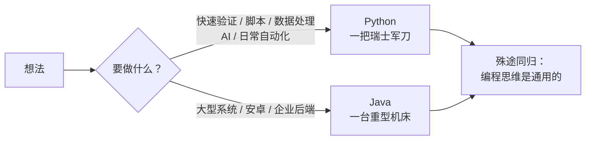
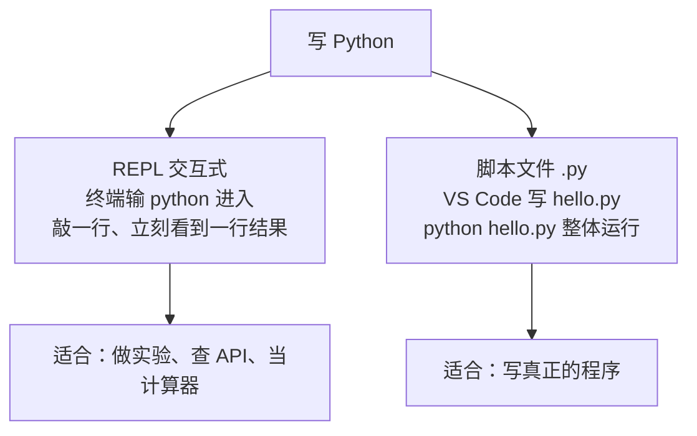

# 🐍 Python 入门：快速上手与实践

> ⏱ 建议用时：2 小时 ｜ 🎯 目标：跑通第一个脚本，掌握变量/流程控制/数据结构/函数的最小集，独立完成三个小练习

## 这篇教程解决什么问题

Python 是目前**最接近自然语言**的主流编程语言：不用编译、不用声明类型、代码量通常是 Java 的三分之一。它最适合的场景是自动化脚本、数据处理和 AI 应用。

如果你已经完成了本站的 [Java 14 天速成计划](/java/day00-环境搭建.md)，这篇教程会让你体验「同一件事的两种做法」——练习题全部复刻 Java 计划里的经典题目（BMI 计算器、猜数字、单词计数），亲手对比两门语言的差异。零基础直接学 Python 也完全没问题。



## 第 0 步：安装与验证

1. 打开 [python.org/downloads](https://www.python.org/downloads/)，下载最新的 Python 3（如 3.12+）
2. Windows 安装时**务必勾选 `Add python.exe to PATH`**（最容易被漏掉的一步）
3. 验证：打开终端（`Win + R` 输入 `cmd`），执行：

```bash
python --version     # 显示 Python 3.12.x 即成功；Windows 上也可能要用 py --version
```

4. 编辑器推荐 VS Code（轻量）+ 官方 Python 扩展；装好后新建 `hello.py`，右上角 ▶️ 即可运行

> ⚠️ 常见坑：提示 `'python' 不是内部或外部命令` → 安装时没勾 PATH，重新运行安装包勾上即可。

## 两种运行方式：对话式 vs 脚本

Python 不需要编译（没有 `javac` 这一步），并且有两种玩法：



现在就试试：终端输入 `python` 回车进入 REPL（出现 `>>>` 提示符），敲一行：

```python
>>> print("Hello, World!")
Hello, World!
>>> 1 + 2 * 3
7
```

按 `Ctrl + Z` 回车（或直接关窗口）退出 REPL。**学习阶段强烈建议多泡 REPL**：任何不确定的语法，敲进去立刻见分晓——这是 Python 对新手最友好的地方。

## 核心语法速览（会 Java 的直接看对照表）

### 变量与类型：不用声明，直接用

```python
age = 20            # int，没有类型声明
price = 9.9         # float
name = "小明"        # str（单双引号都行）
is_vip = True       # bool（注意大写 True/False）

print(f"我是{name}，明年{age + 1}岁")   # f-string：字符串前加 f，大括号里放表达式
```

### 输入：input() 永远返回字符串

```python
name = input("请输入你的名字：")
age = int(input("请输入你的年龄："))    # ⚠️ input() 给的是 str，要数字必须转
height = float(input("身高（米）："))
```

### 流程控制：缩进就是语法

```python
score = 75

if score >= 90:
    print("优秀")          # 冒号 + 4 空格缩进，替代了 Java 的花括号
elif score >= 60:          # 是 elif，不是 else if
    print("及格")
else:
    print("不及格")

for i in range(1, 6):      # range(1, 6) = 1,2,3,4,5（含头不含尾，和 substring 一个脾气）
    print(f"第 {i} 圈")

while True:
    guess = int(input("猜："))
    if guess == 7:
        break              # break / continue 与 Java 完全同款
```

> ⚠️ **IndentationError 是 Python 新手第一大报错**：缩进错了不是风格问题，是语法错误。统一用 4 个空格，VS Code 按 Tab 自动处理。

### Java ↔ Python 对照表

| 做什么 | Java | Python |
|---|---|---|
| 打印 | `System.out.println(x)` | `print(x)` |
| 声明变量 | `int age = 20;` | `age = 20` |
| 读整数 | `sc.nextInt()` | `int(input())` |
| 判断 | `if (a > b) { ... }` | `if a > b:` + 缩进 |
| 循环 5 次 | `for (int i = 0; i < 5; i++)` | `for i in range(5):` |
| 字符串格式化 | `String.format("%.1f", x)` | `f"{x:.1f}"` |
| 比较 | `a == b` | 一样（但 Python 的 `==` 对字符串直接比内容） |
| 语句结尾 | 分号 | 什么都不用 |

## 数据结构四件套

Python 内置四个容器，覆盖日常 95% 的场景：

| 类型 | 长相 | 对应 Java 的 | 特点 |
|---|---|---|---|
| `list` 列表 | `[1, 2, 3]` | `ArrayList` | 有序、可变、最常用 |
| `dict` 字典 | `{"名字": "小明"}` | `HashMap` | 键值对 |
| `tuple` 元组 | `(1, 2)` | 无（类似只读 list） | 创建后不可变 |
| `set` 集合 | `{1, 2, 3}` | `HashSet` | 自动去重 |

```python
# ---- list：一专多能 ----
scores = [90, 75, 88]
scores.append(60)          # 尾部追加
scores[0]                  # 90，下标从 0 开始
scores[-1]                 # 60，负数从尾部数（Java 没有的贴心设计）
len(scores)                # 4
scores.sort()              # 原地排序
for s in scores:           # 增强 for 的既视感
    print(s)

# ---- dict：按键取值 ----
stock = {"苹果": 30, "香蕉": 12}
stock["苹果"]              # 30
stock["梨"] = 8            # 新增
stock.get("橙子", 0)       # 不存在给默认值 0（等价 getOrDefault）
for name, count in stock.items():     # 同时遍历键和值
    print(f"{name} 库存 {count}")

# ---- 切片：一段一截地取 ----
nums = [10, 20, 30, 40, 50]
nums[1:4]                  # [20, 30, 40]——含头不含尾，字符串也能用
"13812345678"[0:3]         # "138"
```

## 函数：def 一把梭

```python
def bmi(weight, height):
    return weight / height ** 2        # ** 是乘方

def greet(name, greeting="你好"):       # 默认参数，Java 得重载才能做到
    print(f"{greeting}，{name}！")

b = bmi(70, 1.75)
greet("小明")                           # 你好，小明！
greet("小红", "早上好")                  # 早上好，小红！
```

## 文件读写：with open 三行搞定

```python
# 写
with open("notes.txt", "w", encoding="utf-8") as f:   # "w" 覆盖，"a" 追加
    f.write("第一行\n")
    f.write("第二行\n")

# 读
with open("notes.txt", encoding="utf-8") as f:         # 读是默认模式
    for line in f:                                     # 逐行迭代
        print(line.strip())                            # strip() 去掉换行符和两端空白
```

对比 Java 的 `BufferedWriter` + try-with-resources：Python 的 `with` 就是同款思路，但行数只有三分之一。

## 💻 动手练习：同题异构（Java 计划原题复刻）

### 练习 1：BMI 计算器（跟打，约 15 分钟）

[Java 版](/java/day01-第一个程序与变量.md)做过，现在用 Python：

```python
height = float(input("身高（米）："))
weight = float(input("体重（公斤）："))

bmi = weight / height ** 2
print(f"你的 BMI 是 {bmi:.1f}")

if bmi < 18.5:
    print("偏瘦")
elif bmi < 24:
    print("正常")
else:
    print("偏胖")
```

感受一下：没有类、没有 main、没有分号，10 行就是完整程序。

### 练习 2：猜数字游戏（半独立，约 25 分钟）

复刻 [Day 2 的猜数字](/java/day02-流程控制.md)。骨架给你，`TODO` 自己补：

```python
import random                       # 导入随机模块

answer = random.randint(1, 100)     # 1~100 的随机整数
count = 0

while True:
    guess = int(input("猜一个 1-100 的数："))
    # TODO: count 加 1
    # TODO: 相等 → 打印次数并 break；大了/小了 → 给提示
```

进阶（选做）：外面套 `while`，问「再来一局吗？(y/n)」，统计最好成绩。

### 练习 3：单词计数（独立，约 20 分钟）

[Day 7 用 HashMap](/java/day07-异常与集合.md) 做过的经典题：输入一句话，输出每个单词出现次数，期望效果：

```
输入: to be or not to be
to=2  be=2  or=1  not=1
```

提示：`input().split()` 直接拆成 list；用 `dict` 计数（`d[w] = d.get(w, 0) + 1`）。写完和 Java 版对比一下行数。

## ❓ 常见问题

| 现象 | 原因与解法 |
|---|---|
| `'python' 不是内部或外部命令` | 安装时没勾 Add to PATH → 重装勾上；或改用 `py` 命令 |
| `ValueError: invalid literal for int()` | 给 `int()` 的字符串不是数字（比如输了个 `abc`）→ 先检查 `input()` 的返回值 |
| `IndentationError` | 缩进不一致或漏缩进 → 统一 4 空格，删掉混入的 Tab |
| `NameError: name 'x' is not defined` | 变量名打错或用在使用之后 → Python 从上往下执行，先定义后使用 |
| 想用第三方库（如 requests） | `pip install requests` 装好后在代码里 `import requests`；pip 是 Python 的包管理器 |
| 读文件中文乱码 | 打开时加 `encoding="utf-8"` |

## 🧠 费曼时刻

**教学卡片**：

```markdown
## Python 入门教学卡片
- 用自己的话讲：Python 和 Java 最明显的 3 个区别是什么？
- input() 为什么要套一层 int()？不套会发生什么？
- 「缩进即语法」是什么意思？IndentationError 一般怎么产生？
- list 和 dict 各举一个生活类比（购物清单？通讯录？）
- 我讲卡壳的地方：
```

## ✅ 自测清单

- [ ] 能说出 REPL 和脚本两种运行方式各自的适用场景
- [ ] 会用 f-string 格式化输出（保留 1 位小数）
- [ ] 猜数字游戏跑通，含「再来一局」进阶版
- [ ] 能解释 `nums[-1]` 和 `nums[1:4]` 的结果
- [ ] 单词计数完成，并和 Java 版对比过行数
- [ ] 知道遇到 `ValueError` / `IndentationError` 第一反应查什么
- [ ] 完成了今天的教学卡片

## 🔗 下一步

- **自动化方向**：用 `os` / `pathlib` 批量整理文件、`openpyxl` 操作 Excel——Python 见效最快的应用场景
- **数据/AI 方向**：NumPy → Pandas → 可视化 / 机器学习
- **Web 方向**：Flask（轻量）或 Django（全家桶）
- 别忘了工具课：[Git 入门：拉取、推送与合并](/git/README.md)，用 Git 管理你的 Python 练习
