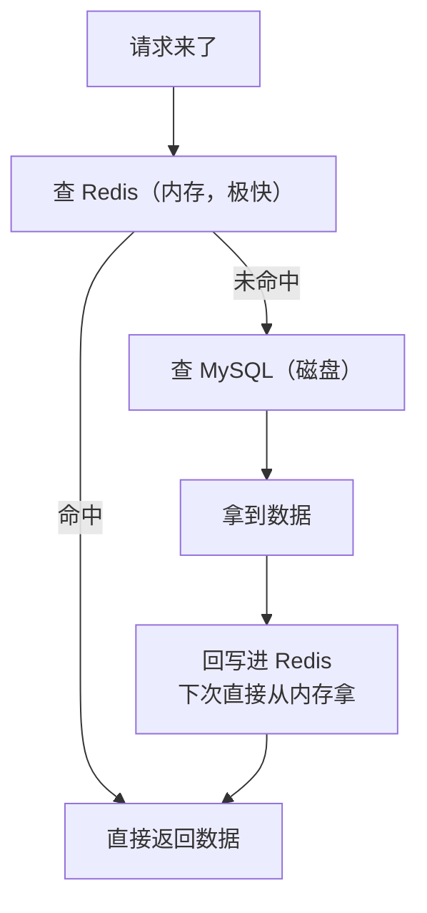
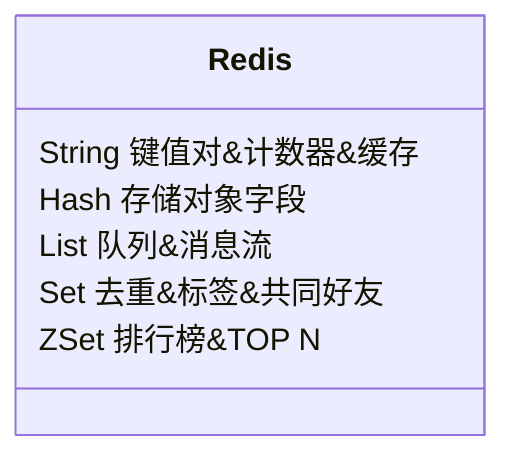

# ⚡ Redis 入门：把数据放进内存

> ⏱ 建议用时：2 小时 ｜ 🎯 目标：会用 Redis 做缓存和简单数据结构存储，理解它在 Web 后端里「快」在哪儿，并能从 MySQL 教程平滑进阶

## 这篇教程解决什么问题

你已经会用 MySQL 存数据了（[MySQL 入门](/mysql/README.md)）。但 MySQL 是**磁盘数据库**：读一次要一次次访问硬盘，程序一多、查询一勤就变慢。而且有些场景根本不用那么重——比如「用户登录态」「页面上那个热门榜单」「验证码」，只需要快进快出。

**Redis** 就为这些而生：**内存数据库**，数据住在内存里。内存读取比磁盘快**成百上千倍**。它是 Web 后端（尤其 Spring Boot 应用）的标配，用来做**缓存**、**会话存储**、**排行榜**这些高频、轻量、需要极快读写的场景。



> 💡 这条「先查缓存、miss 再查库、查到回填缓存」的模式叫**缓存旁路（Cache-Aside）**，是 Redis 最经典、最实用的用法。本教程会用学生管理系统帮你演示。

## 第 0 步：安装与进入命令行

1. **装 Redis**：Windows 用 [Redis Insight](https://redis.io/insight/)（GUI）或 [Memurai](https://www.memurai.com/)（兼容版）；**推荐学 Linux 时用官网版**——自己动手 `sudo apt install redis` 到 Ubuntu/WSL 里
2. **启动**：`redis-server` 起一个 Redis 服务
3. **进入命令行**：另开终端 `redis-cli`，看到 `127.0.0.1:6379>` 即成功

> 和 MySQL 的对照：`redis-server` ≈ 启动 MySQL 服务，`redis-cli` ≈ 打开 MySQL 命令行，`6379` 是 Redis 默认端口（MySQL 是 `3306`）。

## 核心观念：为什么它特别快

| 对比 | MySQL | Redis |
|---|---|---|
| 数据在哪 | **磁盘**（硬盘） | **内存**（内存条） |
| 读写速度 | 毫秒级 | **微秒级**（快数百到数千倍） |
| 数据规模 | 大（GB/TB） | 相对小（受内存大小限制） |
| 持久化 | 强（断电数据还在） | 弱（可配持久化，但主要当缓存） |
| 场景 | 永久存、复杂查询 | 高频读、临时存、简单结构 |

一句话：**MySQL 存的是「家底」，Redis 存的是「手头最近要用的东西」。**

> ⚠️ Redis 数据默认在**内存**，重启可能丢失（除非开启持久化）。它是「缓存/加速」的定位，**不是**取代 MySQL 当主存储。

## Redis 的数据结构（重点，和 MySQL 完全不同）

MySQL 要用表+字段，Redis 是**键值对 + 多种数据结构**。五条 `SET/GET` 之外的经典命令（配示意图）：

### ① String：日常最常用

```bash
SET name "小明"        # 存字符串
GET name               # 拿 → "小明"
SET score 88.5         # 也能存数字
INCR count             # 自增（做计数器极方便，如访问量）
EXPIRE code 60         # 设置 60 秒后过期（验证码/会话就用这个）
```

### ② Hash：像一行数据

```bash
HSET user:1001 name "小明" age 20    # 一个 key 下存多个字段
HGETALL user:1001                     # 拿到这行全部字段
```

### ③ List：有序可增删的列表

```bash
LPUSH tasks "写作业"    # 从左边推进
RPUSH tasks "睡觉"      # 从右边推进
LRANGE tasks 0 -1      # 看全列表（-1 是最后一个）
LPOP tasks             # 从左边弹出（当队列用）
```

### ④ Set：自动去重

```bash
SADD tags "java" "sql"      # 存集合（重复自动忽略）
SMEMBERS tags               # 列出全部
SCARD tags                  # 个数
```

### ⑤ ZSet：带分数的有序集合（排行榜）

```bash
ZADD ranking 88.5 "小明"
ZADD ranking 92.0 "小红"
ZREVRANGE ranking 0 -1     # 按分数从高到低 → 小红、小明
```

**一点直觉**：`String` 像变量，`Hash` 像一行表记录，`List` 像队列，`Set` 像去重的集合，`ZSet` 像排行榜。**大多数后端需求，用 String + Hash 就够你入门了。**



## 💻 动手练习：动手感受五种结构（约 25 分钟）

打开 `redis-cli`，照着敲：

```bash
# String：做一个简易计数器
SET page_views 0
INCR page_views
INCR page_views
GET page_views          # → 2

# Hash：存一个学生
HSET student:id name "小明" age 20 score 88.5
HGETALL student:id      # 看到 name/age/score 三个字段

# List：排队
LPUSH queue "A" "B" "C"
LRANGE queue 0 -1       # → C B A

# Set：标签去重
SADD interests "java" "python"
SADD interests "java"   # 重复，忽略
SMEMBERS interests      # → java python

# ZSet：排行榜
ZADD scoreboard 88.5 "小明" 92.0 "小红"
ZREVRANGE scoreboard 0 -1   # → 小红 小明
```

<details>
<summary>💡 卡住了？常见坑</summary>

- `redis-cli` 连不上：确认 `redis-server` 那个终端还在运行；默认端口 6379
- 命令大小写：Redis 命令不区分大小写，但 key 区分
- 中文乱码：个别终端设置问题，多数情况不影响实际使用（存的还是 UTF-8）
</details>

## 概念升级：什么是「缓存」与「过期」

你已经在上面用过 `EXPIRE` 了。缓存的灵魂有两个：

1. **命中/未命中**：要的数据 Redis 里有（命中）就直接返；没有（未命中）再去数据库拿
2. **过期时间**：设个 TTL（Time To Live），到点自动删除——这就是为什么验证码 60 秒失效、登录态 2 小时过期、首页热点数据 5 分钟刷新

```bash
SET hot_list "[]" EX 300     # 存 5 分钟自动过期（EX 单位秒）
TTL hot_list                # 看还剩多少秒
```

## 💻 综合练习：给学生管理系统加缓存（约 35 分钟）

把它当成 [MySQL 教程](/mysql/README.md)「用 JDBC 存数据库」之后的再升级。目标：查全班成绩时，先看 Redis 没命中再查库：

1. 引入 Java 的 Redis 客户端依赖（[Jedis](https://github.com/redis/jedis)，一个很小的库，Maven 加依赖即可）
2. 查询前先 `GET student:list`
3. 有值 → 直接返回缓存的字符串；无值 → 查 MySQL → 把结果 `SET student:list`（并设个 `EX 60` 过期）→ 返回

```java
// 伪代码骨架（体会思路即可）
String cached = jedis.get("student:list");
if (cached != null) {
    return cached;                          // 命中缓存，不碰数据库
}
List<Student> list = studentDao.findAll();  // 未命中，落库
String json = toJson(list);                 // 简化：转字符串
jedis.setex("student:list", 60, json);      // 回填缓存 + 60 秒过期
return json;
```

> ⚠️ **一致性陷阱**：加了缓存，改学生信息时**必须同时清掉缓存**（`DEL student:list`），否则用户看到的是旧数据。这是缓存最容易踩的坑。

## ❓ 常见问题

| 现象 | 原因与解法 |
|---|---|
| `redis-cli` 提示连接被拒 | `redis-server` 没启动，或端口不是默认 6379（用 `-p 端口` 指定） |
| 数据一重启就没了 | Redis 默认内存存储；开启持久化（`redis.conf` 配 `appendonly yes`） |
| 老读到旧数据 | 改了数据库没清缓存：改数据后执行 `DEL 对应key` |
| Windows 下 `redis-cli` 中文乱码 | 终端编码问题，可用 GUI（Redis Insight）代替 |
| Redis 能取代 MySQL 吗 | **不能**。Redis 是缓存/快读写，MySQL 是可靠主存储，两者分工 |

## 🧠 费曼时刻

**教学卡片**：

```markdown
## Redis 入门教学卡片
- 用「书包 vs 书柜」类比讲：Redis 和 MySQL 的区别？各自存什么？
- 为什么 Redis 快？快是白来的吗（代价是什么）？
- Cache-Aside 三步骤（查缓存→查库→回填）用大白话讲
- String / Hash / List / Set / ZSet 各举一个生活例子
- EXPIRE 解决什么问题？验证码过期怎么实现？
- 为什么改数据后必须删缓存？
- 我讲卡壳的地方：
```

## ✅ 自测清单

- [ ] 能说出 Redis 和 MySQL 的 3 个核心区别
- [ ] `SET` / `GET` / `INCR` / `EXPIRE` 会默写会用
- [ ] 五种数据结构各能说出一个适用场景
- [ ] Cache-Aside 三步走（查缓存→查库→回填）画得出来
- [ ] 理解为什么改数据后要删缓存
- [ ] 学生管理系统缓存的综合练习跑通
- [ ] 完成了今天的教学卡片

## 🔗 下一步

- 往 Spring Boot 走：Redis 是它缓存技术的核心（`@Cacheable` 注解背后就是上面的 Cache-Aside）
- 深入场景：分布式锁（用 Redis 避免并发重复操作）、消息队列（List 的进阶玩法）、Session 共享（登录态存 Redis）
- 学完可以和 [Linux](/linux/README.md) 组合：在你的云服务器上装 Redis，用它缓存你的学生管理系统
