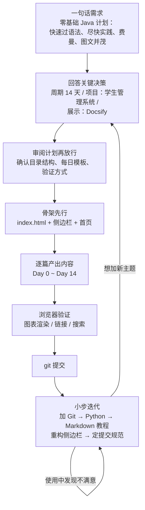
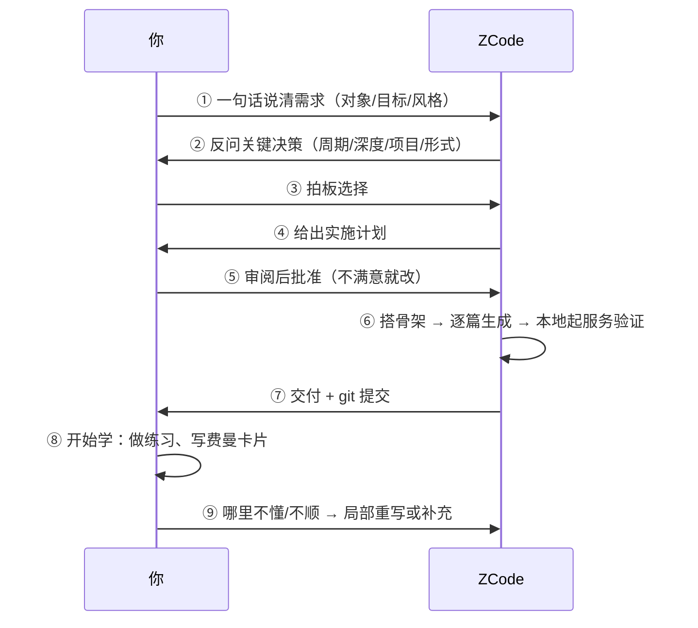

# 🤖 用 ZCode 创建入门教程：从想法到上线

> ⏱ 阅读用时：40 分钟 ｜ 🎯 目标：掌握「让 AI 帮你定制学习教程」的完整流程——本站的 Java / Python / Markdown / Git 教程就是这样诞生的

## 这份手册解决什么问题

想学一门新东西时，网上找教程总有各种不顺：节奏太慢、练习太水、深度不对、语言风格不喜欢。**既然有 ZCode 这样的编程代理，为什么不让它为你定制一份？**

这份手册复盘本站（cs-campus）的真实创建过程——从第一句「先添加一个 Java 的学习计划」开始，到一个包含四套教程、门户式导航、提交规范的文档站——并把过程中的做法提炼成**你可以直接复用的流程和提示词模板**。

先说最重要的心法：

> **AI 生成教程 ≠ 你学会了。** 正确姿势是费曼式的：你定方向和标准 → AI 产出初稿 → **你来学**、做练习、写教学卡片 → 讲不出来或觉得不好的地方，让 AI 再改。教程是「为你定制」的半成品，学习永远发生在你这边。

## 实战回顾：本站是怎么一步步建出来的

整个过程可以浓缩成一张图：



关键节点与当时的真实指令：

| 阶段 | 当时对 ZCode 说的（原话大意） | 换来的结果 |
|---|---|---|
| ① 提需求 | 「先添加一个 Java 的学习计划，面向零基础，快速过知识点尽快实践，费曼学习法，图文并茂，Markdown 载体 + HTML 展示」 | ZCode 进入规划，提出 3 个关键问题 |
| ② 做决策 | 回答「14 天 / 控制台学生管理系统 / Docsify」 | 确定整体方案，产出计划等待审批 |
| ③ 审计划 | 看目录结构、每日五段式模板、验证方式，批准 | 骨架 + 15 篇文档一次成型 |
| ④ 加内容 | 「再到 docs 添加一块内容 git，只要入门：拉取推送合并」 | 单页 Git 教程 + 导航入口 |
| ⑤ 提意见 | 「我觉得侧边栏不太好，特别是 java 14 天速成」 | 重构成门户式两层导航 |
| ⑥ 定规范 | 「提交信息要中文」「不要填 scope」「不要推荐 npx serve」 | AGENTS.md 沉淀为长期约定 |

注意 ⑤⑥：**AI 的第一版不会完美，你只需要在使用中指出不满**，不需要自己动手改——这正是个性化的来源。

## 通用流程：从「想学 X」到「教程上线」



### 第一步：需求一句话模板

不用写很长，但要覆盖五个要素（本站 Java 计划的原需求就是一句 80 字的话）：

```text
给【谁：零基础/有 X 基础】写一份【主题】的入门教程，
目标是【快速过语法尽早实践 / 系统深入 / 面试题向】，
风格要求【费曼式输出 / 只给骨架不给答案 / 图文并茂】，
载体是【Markdown 文档 + 本地可浏览的站点】，
最终实践项目做一个【和主题匹配的小项目】。
```

### 第二步：准备好回答三个决策

ZCode 规划时通常会问，提前想好答案能省一轮往返：

1. **周期/篇幅**：7 天极速、14 天标准，还是 30 天从容？（决定每天信息密度）
2. **实践项目**：学完做什么？（决定前面知识点的取舍）
3. **形式**：纯 Markdown、Docsify 站点，还是别的？（决定维护成本）

### 第三步：审计划时看四件事

计划（Plan）批不批，看这四点，不满意直接在对话里说：

- 目录结构是否合理（文件命名、分几个模块）
- 每篇的模板是否合口味（比如本站的五段式）
- 是否包含验证环节（能不能本地跑起来看效果）
- 内容红线（要不要留答案、示例代码用什么版本）

### 第四步：验收时亲手检查

ZCode 交付后会自测，但**教程是给你用的，你要亲手过一遍**：

- [ ] 本地起服务能打开，导航正常
- [ ] 随机抽两篇：图表渲染正常、代码示例能跑通
- [ ] 练习难度梯度合理（跟打 → 半独立 → 独立）
- [ ] 答案留白程度符合预期（想抄都抄不了）

### 第五步：学习中持续迭代

教程是活文档。学的过程中随时回头找 ZCode：

- 「Day 5 的多态那个例子我没懂，换个生活化的类比重写」
- 「加一天专门讲调试技巧，用断点跑通猜数字游戏」
- 「把练习 3 的提示再藏深一点，我老忍不住看」

## 提示词速查：拿来就用

<details>
<summary>💡 展开：三个场景的完整提示词示例</summary>

**场景一：全新主题（示例：Rust）**

```text
在 docs/rust/ 下新建一份 Rust 入门教程：我是零基础（已学完本站的 Java 计划），
7 天速成，每天 1 小时。要求：快速过语法、尽早写代码、每天费曼输出，
风格与本站 Java 计划一致（五段式模板 + mermaid 图表），不提供完整参考答案。
最终用命令行 todo 工具做实践项目。侧边栏按本站门户式规则接入。
```

**场景二：补充局部**

```text
Java 计划的 Day 7 讲集合太赶了，把 ArrayList 和 HashMap 拆成两天，
原 Day 7 只留异常，后面天数顺延，同步更新子侧边栏和所有上下篇链接。
```

**场景三：结构调整**

```text
侧边栏里 Rust 教程的条目太多了，参照 java/ 的做法给它建独立的 _sidebar.md，
根侧边栏只留一个入口。
```
</details>

## 质量把关：AI 生成内容的常见坑

| 坑 | 症状 | 怎么防 |
|---|---|---|
| 看起来对、跑不通 | 示例代码有编译错误、API 记错 | 关键代码亲手跑一遍再往下学 |
| 答案给太满 | 练习带完整解答，看一眼就会了 | 提需求时就写明「只给骨架和提示」 |
| 图表变代码 | mermaid 语法错误渲染失败 | 交付验收时抽查图表渲染 |
| 越写越散 | 文档多了导航混乱 | 及早定结构约定（本站的门户式侧边栏） |
| 一次性幻觉 | 生僻版本的 API、不存在的库 | 版本写进需求（如 JDK 21、Python 3.12） |

## 把约定沉淀下来：AGENTS.md

本仓库的 `AGENTS.md` 是给 ZCode 的**长期备忘**：文档命名规则、侧边栏结构、mermaid 约束、中文提交规范、内容红线都写在里面。这样即使开一个全新对话，ZCode 也能自动遵守——你不用每次重复交代。

**给你的建议**：用 ZCode 维护任何长期项目时，把「重复说了两次以上」的偏好都让它沉淀进 AGENTS.md。本站的「中文提交」「不用 npx serve」「不要 scope」就是这么来的。

## ✅ 上手清单

下次想学新东西时，照着走：

- [ ] 用需求模板写一句话（五个要素）
- [ ] 回答三个决策问题（周期 / 项目 / 形式）
- [ ] 审计划：结构、模板、验证、红线
- [ ] 交付后亲手验收：服务、图表、代码、练习梯度
- [ ] 学起来，遇到不顺就回去让 ZCode 改
- [ ] 固定的偏好让它写进 AGENTS.md

## 🔗 下一步

- 试着用场景一的模板，让 ZCode 给你定制下一门教程（数据库？前端？）
- 配套阅读：[Markdown 入门](/markdown/README.md)——学会它，你就能亲手润色 AI 生成的文档
- 用 [Git 入门](/git/README.md)管理你的学习仓库，每学完一篇就提交一次
